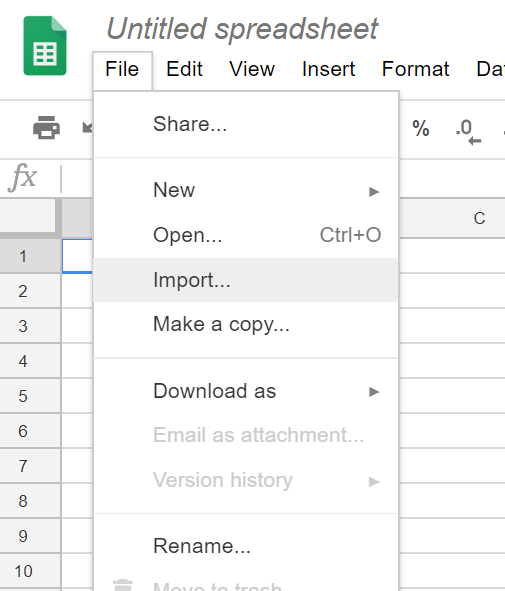
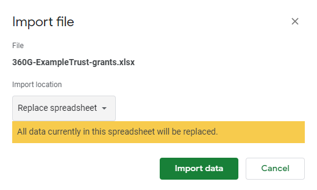
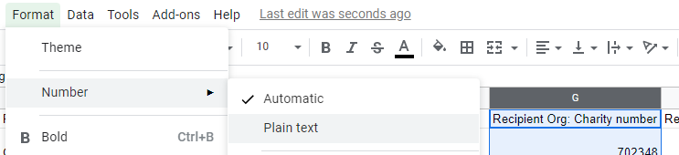

# Hosting your data using cloud storage
Typically, publishers of 360Giving grant data share their dataset files (Excel, CSV or JSON formats) by publishing them on their websites and providing a URL for the 360Giving Data Registry. 

For some publishers without a website (or web hosting) an alternative means of sharing their data is required. Sharing data through accessible and popular file sharing (cloud storage) services provides a workable alternative. 

Below is a step by step guide to using two file sharing services to host 360Giving data; Google Drive and Dropbox. 

## Google Sheets
Google provides users with the Google Drive service, offering 15GB of space for free. 

To share a 360Giving data file using Google Drive, it must first be converted to a Google Sheets document.

1\. On your Google Drive, create a new Google Sheets document (select New > Google Sheets). 

2\. Import your 360Giving Excel or CSV file to the Google Sheets (select File > Import > Upload, and select the file from your computer or drag-and-drop). 

3\. If you are using an **Excel file** choose ‘Replace Spreadsheet’ and click Import data. 

4\. If you are using a **CSV file** choose ‘Replace Spreadsheet’ as your import option. Choose Separator type as ‘Detect automatically’ and answer ‘Yes’ to Convert text to numbers and dates and click Import data. 

5\. If included in your data check the **Recipient Org:Charity Number** and **Recipient Org:Company Number** columns. Google Sheets will sometimes interpret these columns incorrectly and place decimal points into them. There is a simple fix by selecting the whole column (click the column letter) and then using the menu to select Format > Number > Plaintext. 

6\. You can rename the file with your prefered title with File > Rename. 

7\. Share your file so that it is publically accessible to anyone with the link (select Share and select Get Shareable Link). Select the Link Sharing option ‘On - anyone with the link can view’. 

8\. Copy this link, which will resemble the following example: 

https://docs.google.com/spreadsheets/d/1gyyHFzS60yrMqindaaTNW8kSFa0sOIZAjDIR8sZ5dLA/edit?usp=sharing

9\. Change the end of the link to **export?format=xlsx** so that it resembles the following: 

https://docs.google.com/spreadsheets/d/1gyyHFzS60yrMqindaaTNW8kSFa0sOIZAjDIR8sZ5dLA/export?format=xlsx

10\. Copy this newly-formatted link and test that your data is still valid using the <a href="https://dataquality.threesixtygiving.org" target="_blank">360Giving Data Quality Tool<a/>
  
11\. Submit the link to 360Giving Helpdesk via <support@threesixtygiving.org> to be added to the Data Registry. 

It is best practice to keep your published data in this single Google Sheets document. If another Google Sheets document is created, the link will be different and therefore need to be changed in the 360Giving Data Registry. To replace a current Google Sheets document with an updated Excel or CSV file of 360Giving formatted grants data follow Steps 2 and 3 or 4, above. This imports a new Excel or CSV file and replaces the data currently there. 

## Dropbox 
Dropbox provides users with a Basic account, offering 2GB of space for free. 

The process of sharing 360Giving data files through Dropbox is straightforward.

1\. Upload the file to your Dropbox account, storing it in whatever folder you find useful.
  
2\. Share the file by creating a shared link for view-only access (anyone with the link can view the file, but can’t alter it).
  
3\. Copy this link. It will resemble the following example: 
https://www.dropbox.com/s/ju3b1wne41xbowy/360Giving-dataset.xlsx?dl=0 
  
4\. Change the ending of this from ‘dl=0’ to ‘dl=1’, eg: 
https://www.dropbox.com/s/ju3b1wne41xbowy/360Giving-dataset.xlsx?dl=1 
  
5\. Copy this newly-formatted link and test that your data is still valid using the 360Giving Data Quality Tool: https://dataquality.threesixtygiving.org/
  
6\. Submit the link to 360Giving Helpdesk via <support@threesixtygiving.org> to be added to the Data Registry. 

Be aware that this link can easily be changed (by being deleted and re-created) and therefore will become invalid. If this happens you will need to let the 360 support team know the new link to your data.

    <a href="https://standard.threesixtygiving.org/en/new-docs-style/guidance/publish-data-openly/" class="button button--teal">Previous</a> <a href="https://standard.threesixtygiving.org/en/new-docs-style/guidance/making-updates/" class="button button--teal">Next</a>

 
 

