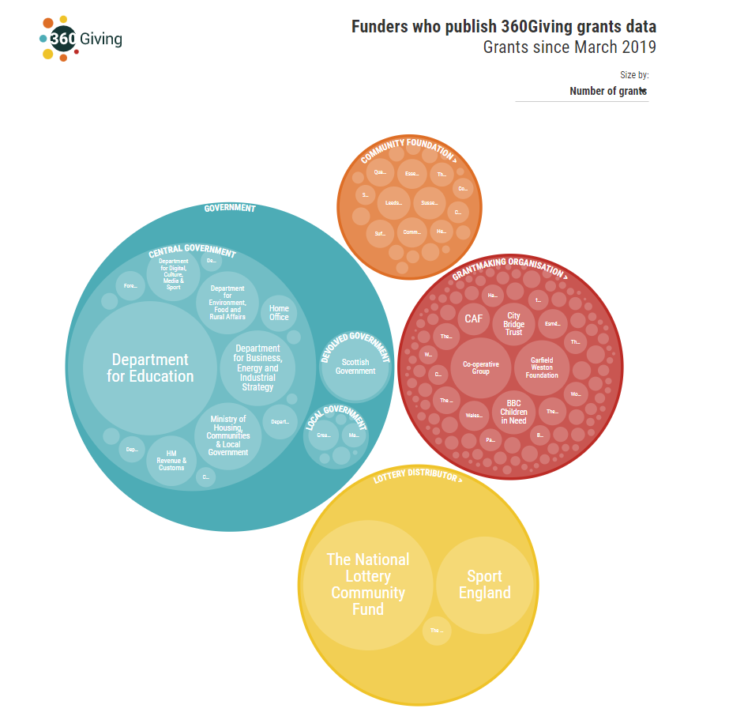

# Useful information before you start
This guide will help organisations publish 360Giving data for the first time.

It will also be useful to:
- People taking over responsibility for preparing and sharing 360Giving data for their organisation from a colleague.
- Anyone who wants to know more about what sharing 360Giving data involves.

## What to expect
Guidance for publishers sets out the three key stages in the 360Giving publishing process, and highlights the options available and factors that will inform the choices you make.

These stages apply to all types of funder. However, the approach you take, the support you need, and how long the process will take can all vary, depending on a few factors:
- The information you collect about your grantmaking
- The systems you use to manage the data
- How much data you want to publish 
- Your organisational and technical capacity

### The three stages of the publishing process

#### 1. Plan
- You will identify the scope of the grant information you want to share by looking at the data in your systems, and comparing it with the available 360Giving Data Standard fields.
- You can also take inspiration from what other funders have included in their 360Giving data.
- Once you have identified the grant information you intend to publish, you should consider the data protection implications of sharing this data, and develop appropriate policies so you can do so responsibly.

    <a href="https://standard.threesixtygiving.org/en/new-docs-style/guidance/plan-the-process/" class="button button--teal">Read more</a>

#### 2. Prepare
- You will transform your grant information into 360Giving data, using the correct formatting and headings.

For many publishers, preparing their data is a manual process that involves exporting information from a grants management system and converting it in a spreadsheet. However, some grants management systems make it possible to build-in some or all of the steps needed to convert the information, so it can be exported directly in 360Giving data format.

- You will use the <a href="https://dataquality.threesixtygiving.org/" target="_blank">360Giving Data Quality Tool</a> to check if your data is ready to be published.

    <a href="https://standard.threesixtygiving.org/en/new-docs-style/guidance/prepare-data/" class="button button--teal">Read more</a>

#### 3. Publish
- Your prepared file of 360Giving data needs to be made available online accompanied with an open license, which provides clear permissions to allow for its use. This step usually involves uploading the file to your website and linking to the file with text referring to the open license. 
- The final step is to let 360Giving know that your data has been published.
- Once your file of 360Giving data has been published openly, a link to it will be added to the <a href="https://data.threesixtygiving.org/" target="_blank">360Giving Data Registry</a>. Your grant data will then start to appear in <a href="https://grantnav.threesixtygiving.org/" target="_blank">GrantNav</a>, <a href="https://insights.threesixtygiving.org/" target="_blank">360Insights</a> and other tools and platforms that use 360Giving data.

    <a href="https://standard.threesixtygiving.org/en/new-docs-style/guidance/publish-data-openly/" class="button button--teal">Read more</a>

#### Updating 360Giving data
- Once you have published 360Giving data for the first time, you will decide whether to make updates to add more grants on an annual basis or more frequently.
- Documenting your publishing process will make it easier to make updates.

    <a href="https://standard.threesixtygiving.org/en/new-docs-style/guidance/making-updates/" class="button button--teal">Read more</a>

### 360Giving support is free
There are no registration fees or costs associated with publishing your grants data in the 360Giving Data Standard. 360Giving support for publishers is provided free of charge. 

Preparing 360Giving data does require a commitment of resources from the publisher in terms of staff time, especially when publishing your data for the first time. 

There can however be costs related to consultancy or support fees to get a grants management system set up to export 360Giving data. 

#### 360Giving Helpdesk
Our Helpdesk provides pro-bono support to help funders navigate the steps to publish their grant data using the 360Giving Data Standard. We provide guidance and direct support to help streamline the process as far as possible.

At any point in this process we invite you to contact our free Helpdesk via <support@threesixtygiving.org> with queries, large or small.

## Who publishes 360Giving data
Any type of funder can publish their grants data to the 360Giving Data Standard. Over 200 funders share 360Giving data. They range in size from large organisations with many staff to small trustee-run trusts and include family, corporate and community foundations, central, devolved and local governments, lottery distributors and livery companies.

The majority of funders sharing 360Giving data make grants to recipients based in the UK, however it is also possible to use the 360Giving Data Standard to share data about international grants.

Read <a href="https://www.threesixtygiving.org/2021/07/01/how-has-grants-data-grown/" target="_blank">our blog</a> to find out more about the different types of funders publishing 360Giving data.

### Why publish 360Giving data?
Find out more about <a href="https://www.threesixtygiving.org/support/why-publish-grants-data/" target="_blank">the benefits of publishing 360Giving data.</a> 

## About grants management systems
Funders of all shapes and sizes have become 360Giving data publishers, using a wide range of grants management systems and some by collecting basic data in spreadsheets.

Where and how you collect and store information about your grants has a fundamental impact on the data you will be able to share. This will also influence the practical process taken to format your data to the 360Giving Data Standard. 

One of the first questions we’ll ask when you contact 360Giving Helpdesk is what grants management systems you use. Whatever the answer, there will be useful learning we can share from our work supporting over 200 other funders to share their grants data.

Go to the [Prepare section](https://standard.threesixtygiving.org/en/new-docs-style/guidance/prepare-data/) for further details about the likely impact your grants management system on your publishing process.

### Publishing resources for community foundations
For community foundations using the Digits2 grants management system there is special guidance about how to use a built-in 360Giving data extract for publishing 360Giving data. Access the Community Foundations Guide to 360Giving data <a href="https://www.threesixtygiving.org/communityfoundations/cf-publishing-guide/" target="_blank">here.</a>

## Key concepts

### Open data
360Giving data is open data, which is defined as follows:

   > Open means anyone can freely access, use, modify, and share for any purpose (subject, at most, to requirements that preserve provenance and openness).

For further information visit the <a href="https://opendefinition.org/" target="_blank">Open Definition website.</a>

### 360Giving data
360Giving data is the term we use to describe any grant information shared using the 360Giving Data Standard. 360Giving data can be viewed in files published by a wide range of funders or explored in online tools built by 360Giving and others.

### Publishers and publishing
Organisations that share 360Giving data are the owners of the information and when they make the files of data available online as open data, it is called **publishing the data**. That is why we call the funders that share 360Giving data **Publishers**.

### JSON
The 360Giving Data Standard is defined by a JSON Schema, which describes the structure and attributes of the information can be shared. JSON, which stands for **JavaScript Object Notation**, is a data interchange format commonly used for transmitting data in web applications. 

For further information visit the <a href="https://json-schema.org/" target="_blank">JSON schema website.</a>

