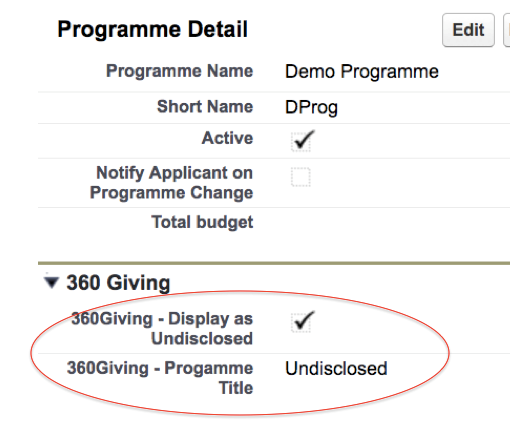

# Publishing guide for community foundations
In collaboration with UKCF, 360Giving has supported the development of a tool for the Digits2 (D2) system which means that grant information can be extracted from your system ready-formatted to the 360Giving Data Standard.

Community foundations participating in a pilot were consulted to agree a field specification for the 360Giving data extract file. Hyphen8 has completed development of the D2 data extract tool, and following tests by the pilot group this is now available for any community foundation that wishes to share open grants data.

This tool means that the technical aspects of preparing your data will be automated, making the process easier and quicker. There are some additional practical steps you need to follow when sharing your 360Giving data for the first time, for example the hosting and licensing of the data.

There is specific step-by-step guidance for community foundations using the D2 tool, in addition to the other general guidance for publishers found on this site. The guidance for community foundations can be found below and downloaded in a PDF document.

## The information included in the D2 extract 
The D2 360Giving data extract tool allows you to publish useful information about the grants you have awarded.

The range of information fields included in the extract file is fixed, however you can control the content of your data by using report filters, for example to decide what time period or grant programmes will be included. 

See the **Prepare section** for further guidance about [deciding the scope of your data.](
https://standard.threesixtygiving.org/en/new-docs-style/guidance/plan-the-process/#decide-what-kind-of-grants-to-include)

See the guidance on [data protection](https://standard.threesixtygiving.org/en/new-docs-style/guidance/data-protection/) to consider the implications for your organisation of sharing open grants data.

### What to consider if you make grants to individuals
The D2 360Giving extract tool automatically anonymises the names of individuals who have received grant awards. The beneficiary location for individual grant awards is shared at local District or Ward level.

The D2 extract anonymises the names of individuals, however extra care should be taken to check other fields in the grant data, such as **Title**, **Description** and **Recipient Org:Description**, as well as Beneficiary fields, to ensure that this information, on its own or when combined, cannot be used to identify the individual concerned.

If you take further steps to anonymise or remove potentially identifying data make a note of the changes you make, and ensure these checks and steps are taken each time you publish new data. 

### Anonymising donor names in programme titles.
If programme titles include the names of donors the D2 360Giving extract has been developed to allow the names to be redacted. There is further guidance below about how to set programme names as ‘undisclosed’.

## Contact 360Giving to get access to D2 extract 
Each community foundation must be set up with access to the 360Giving reports folder in order to generate the source report and extract 360Giving data. If you cannot find the 360Giving report folder in your D2 system, please contact <support@threesixtygiving.org> to request this to be set up.

The following information about your organisation will be added into the system to populate key 360Giving fields. When you request access to the D2 extract for the first time these details will be confirmed with you.

|360Giving information   | Notes|
|------------------------|-------|
|Funding Org:Name        |This is your organisation name as you want it to appear in your data. This could be your ‘brand name’ rather than your full registered name.|
|Funding Org:Identifier  |This is created based on your registered charity number|
|Publisher prefix        |This is used to register your organisation with 360Giving and provides a prefix for grant identifiers.|

We will also check whether access to the Digits2 tool should be restricted to certain individuals in your organisation, or if it can be set up as accessible to all users. If you need to restrict access we will ask for the names and emails of the people who will have permission to access the tool, so they can be added to the system.

### Walk-through video
<a href="https://vimeo.com/239307295/d94dd749c1" target="_blank=">Watch the Hyphen8 video walk-through<a/> to get an overview of the process and follow the instructions below to export 360Giving data from your D2 system.
 
## The source report
A dedicated report folder is created for each community foundation containing the template report that is used as the source for the data extract.  This report can be used to check data quality and to apply the correct filter criteria to limit the grant applications that are included.
 

Navigate to the **Reports** tab:
- Locate the folder that is prefixed with your Community Foundation name and followed by ‘360Giving Reports’ (enter 360 in the folder search box to find this folder)
- Click on the folder to display the template report 
- Click on the report name to open the report

The report template contains all the fields that are sourced directly from the grant application and the associated applicant account records that are included in the agreed 360Giving field specification.
 
The default filter shown below is set to include all grant applications that have a Record Type of ‘General Approved’ and an amount greater than zero.
 
You can change the DATE filter to control the grant applications that you would like to include in the extract. Use this report to check the information that will be published and edit it in the source fields if required – particularly text fields such as **Project description – summary** and **Purpose of Organisation** and **Project name**.
 
 

#### Note: 
- **DO NOT remove** the Grant Application ID (circled above) from the report OR move it from the first column – this must remain where it is for the extract process to work
- If you drag additional fields in to the report, they will NOT be included in the grant extract file but can be included for checking purposes
- Individual grant recipient names will appear in the report, but these will default to ‘Individual recipient’ in the extract file if they are a Person Account instead of an organization.
- If project name is blank, then the output will default to ‘Grant to org name’ – if it is person account this will output ‘Individual recipient’

The following system-generated fixed or calculated values will not appear in the report but will be included in the extract file:

| **360Giving field**      | **Salesforce source** | **Notes** |
| -----------          | -----------       |--------|
| Identifier           | Grant Application Reference Number             |    The grant identifier will be the Grant Application unique Grant Application reference number prefixed with each Community Foundation’s unique organization identifier e.g. 360G-CF-XXXXXXX    |
| FundingOrg:Identifier| Static value for each CF held on CF Profile record | This is a unique identifier for each Community Foundation made up of a prefix and their charity number. Eg GB-CHC-1151621  |
|FundingOrg:Name|Static value for each CF held on CF Profile record |Name of Community Foundation|
|Planned Dates: Duration (months)	|Default Value	|To be calculated based on start and end dates|
|Beneficiary Location:Country Code|	Default Value	|Default to GB|
|Beneficiary Location:Geographic Code Type|	Default Value|	The data extract supports all geography levels, super output area, Ward, Local authority, Westminster Parliamentary or Constituency.|
|Currency|Default Value|	Default to GBP|
|Last modified|Default Value|	This is the date on which the data was last updated and will be populated automatically|
 
### Undisclosed programme
If you do not want to publish the name of specific Programmes, there are 2 new fields in the 360 Giving section on a programme record.  Tick the 360Giving – Display as undisclosed checkbox and the 360Giving – Programme Title will default to Undisclosed.  This is the value that will show in the programme name on the data extract.
 
  

### Generating the file
To generate the formatted extract file in .xls format, go to the new tab called **Export Grants Data to 360 Giving**.

This can be added to the tabs across the top menu bar (by accessing customise my tabs via + symbol) or just by locating it in the list of **All tabs** displayed when you click on the + symbol on the right of the menu bar.
 
   
 
You will see your Community Foundation’s summary identifier information displayed at the top.
 
Click on the **Import grants from a report** dropdown and the report template that is stored in the dedicated folder will be displayed.

    
 
Click on the report and the following message will appear:
 
    

The total number of rows in the report will display.

   
 
Click on the **Export Excel** button to generate the extract file.
 
**Note:** the file may take longer to open if there are a large number of records in the file so you may need to be patient.
 
Open the excel file to review data.

Save the file to your local drive as an .xlsx file. To do this click on ‘Save file as’ and **choose Excel Workbook with the .xlsx file extension**.
 
## Check data quality and receive feedback
Once you have exported a file of your data using the 360Giving extract, the next step is to check that the data is valid. Valid data means the file includes all the required fields and the information has the correct formatting.

Each Community Foundation is responsible for the data it publishes.  You can check that your data is valid using this Data Quality Tool developed, which will tell you if there are any issues with your dataset.

See our guidance on [checking data quality](https://standard.threesixtygiving.org/en/new-docs-style/guidance/data-quality/) before publishing the data.

## Publishing your 360Giving data
Once you are happy with your data file and the Data Quality tool shows that the data is valid, the next step is to find a place on your website for hosting the file and outlining the open license you are releasing it under.

All organisations publishing data to the 360Giving Standard host their files on their own website, which means they have control over and are responsible for their data. 

See our guidance on [publishing your data openly]( 
https://standard.threesixtygiving.org/en/new-docs-style/guidance/publish-data-openly/) for further details.
