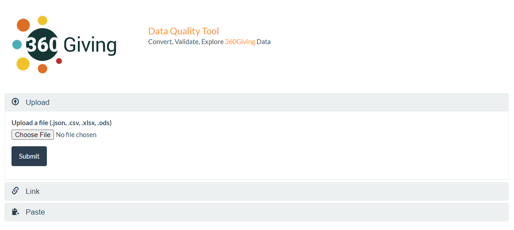
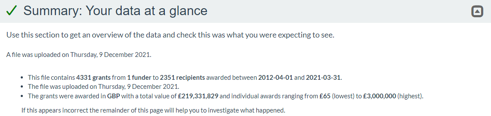
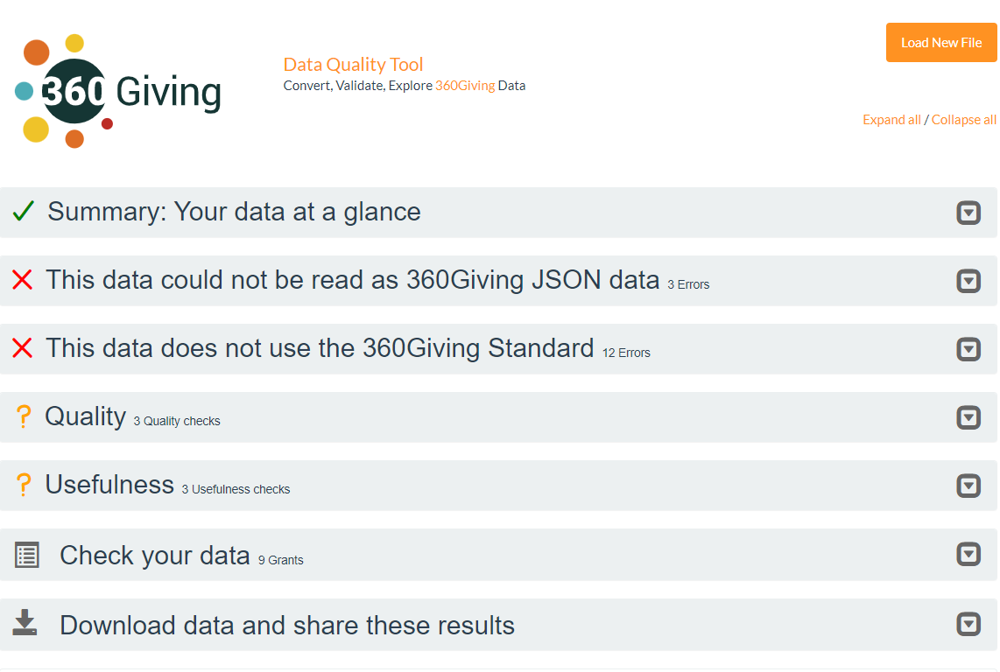
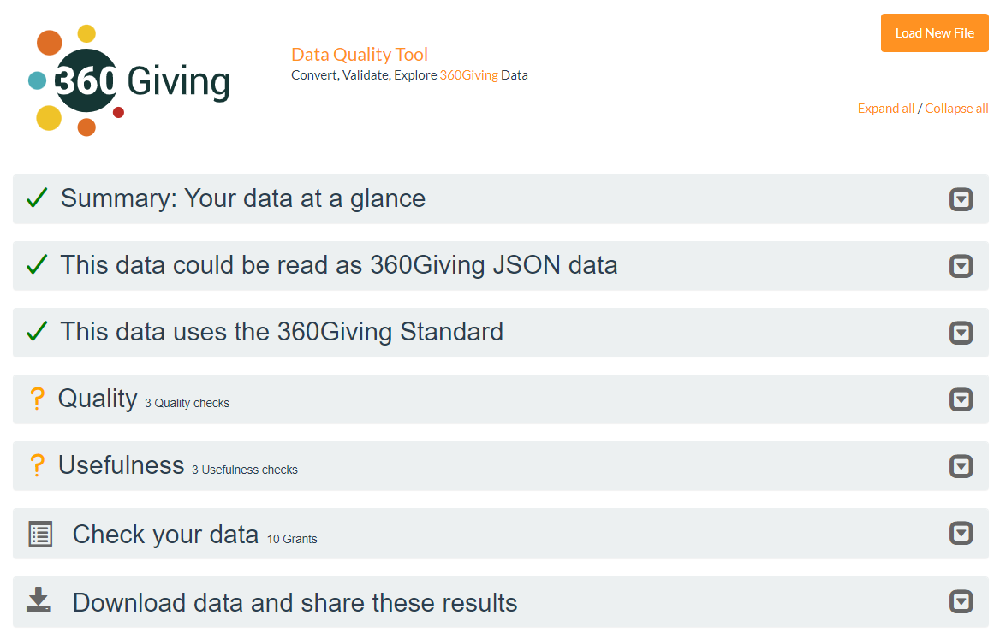

# Check data quality

    <h2 class="box__heading">Key tasks</h2>
    
<ol>
      <li>Upload your prepared 360Giving data into the <a href="https://dataquality.threesixtygiving.org/" target="_blank">360Giving Data Quality tool.</a></li>
      <li>Review feedback and make updates if the data is invalid.</li>
      <li>Check data quality and usefulness feedback.</li>
      </ol>

## Overview
Once you have prepared your file of grants data the next step is to check that it is correctly formatted 360Giving data – known technically as 'valid' data – using the 360Giving Data Quality tool.

The term 'valid' means the file includes the 10 core fields and the information has all the correct data formatting. 

Only valid 360Giving data can be combined with other published data and be included in 360Giving tools, such as <a href="https://grantnav.threesixtygiving.org/" target="_blank">GrantNav</a> and <a href="https://insights.threesixtygiving.org/" target="_blank">360Insights</a>.

## Using the Data Quality Tool
<a href="https://dataquality.threesixtygiving.org/" target="_blank">The Data Quality Tool</a> has been specially designed to support the preparation and publication of 360Giving data.

You can upload or provide a link to a spreadsheet or JSON file or paste in JSON formatted data.

Once you have submitted your file the screen will display feedback on key information points about the data. Use the small arrow icon on the far right to display or hide the details.

### Understanding the results

At the top, the summary provides basic details about the content of the file – how many grants, funders and the date range and total value of the grants broken down by currency.

✔️ **a green tick** means that the data has passed all of the validity tests.

❌ **a red cross** means there are issues with the data that must be resolved to make the data valid (conform to the 360Giving Data Standard).

The Tool makes **Additional checks** which suggest ways to improve the quality of your data.

#### If your data has red crosses
When a file has one or more red cross it means there is an issue with the data formatting or scope of information included which must be fixed to make the data ready for publishing.

The tool includes explanations of the <a href="https://dataquality.threesixtygiving.org/common_errors" target="_blank">common errors </a> that can cause the data to be invalid.

### About the Additional checks
These **Additional checks** do not relate to the validity of the data. This means you can move forward with publishing data without addressing all (or any of) the feedback in this section. Some feedback may not be relevant to your particular circumstances and the information you have decided to include in your 360Giving data. 

- **Quality** checks highlight data that may be incorrect or need further attention, such as charity or company numbers with the wrong formatting.

- **Usefulness** checks highlight areas which contribute to the usefulness of the data, focused on the recommended fields.

- **Additional Fields** show the details of data not covered by 360Giving Data Standard headings. If these additional fields are unexpected the results could be caused by misnaming or spelling mistakes in the headings.

### Getting more help
Please contact the 360Giving Helpdesk via <support@threesixtygiving.org> if you have questions about using the Data Quality tool or the feedback you receive.

The 360Giving Helpdesk can also look at the data you are preparing to check and provide further feedback prior to publishing your data for the first time.

## Once the data passes the checks
Once your file has all green ticks it means the information is valid 360Giving data.

Passing the Data Quality Tool checks means the file is ready for use, including in platforms such as GrantNav. However the tool cannot check the content of the data. This means there may be further checks needed to make sure the information is accurate, and that the data does not include information that is unsuitable for publishing as open data.

    <h3 class="box__heading">Data protection</h3>
    
Find out more about what to check before publishing your data openly in our <a href="../../guidance/data-protection" target="_blank">data protection guidance.</a>

### About Data Quality Tool security
The Data Quality Tool has been designed to support people preparing their 360Giving data, meaning the data inputted into it is in varying stages of readiness. 

The feedback report you receive has a private URL which means only those with the link can access the page and the data. If your data is not suitable for sharing publicly then you should treat this URL with care and only share it with people who are allowed access to the data. As long as you do not put the URL on a public page, then it will not be possible for people to come across it by accident.

The files are deleted automatically from the Data Quality Tool after seven days. For further details about how the files are stored and deleted read the <a href="https://dataquality.threesixtygiving.org/" target="_blank">‘More Information’</a> section on the homepage of the tool and the <a href="https://dataquality.threesixtygiving.org/terms/" target="_blank">Terms and Conditions.</a> 

### What's next?
Read our guidance about how to published your grant data openly making it available for anyone to download and use.

