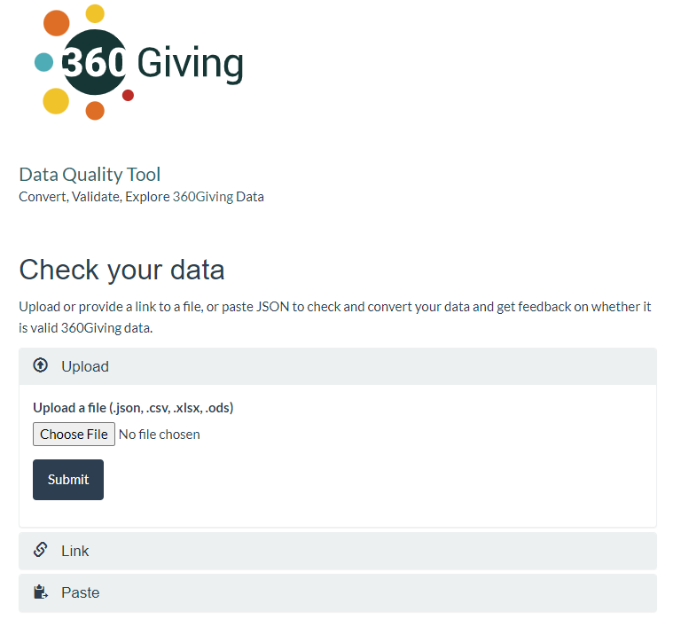
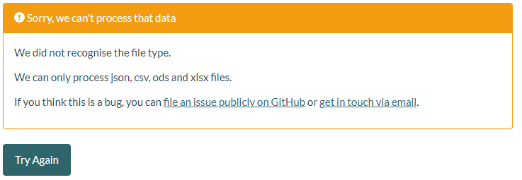
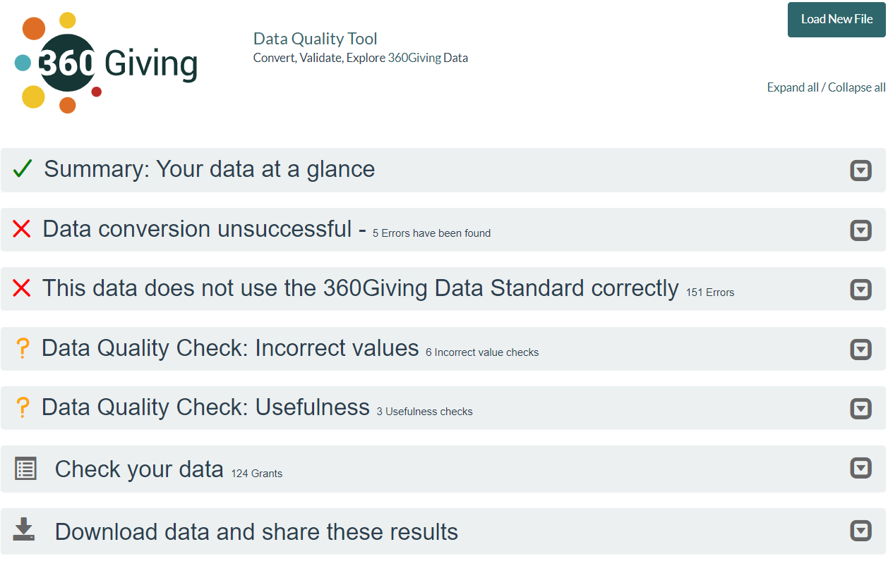
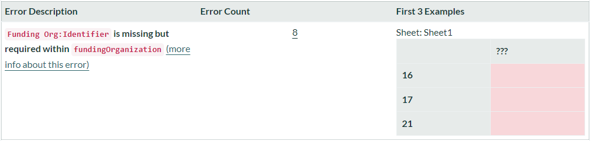
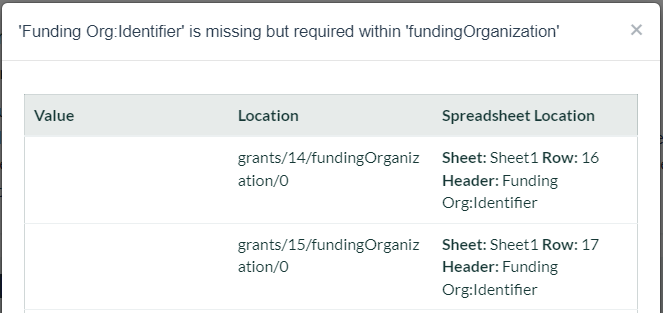
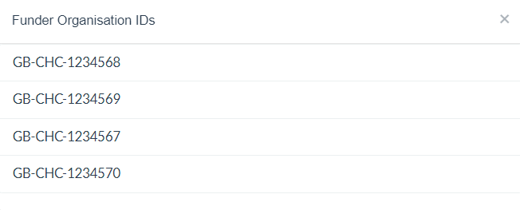
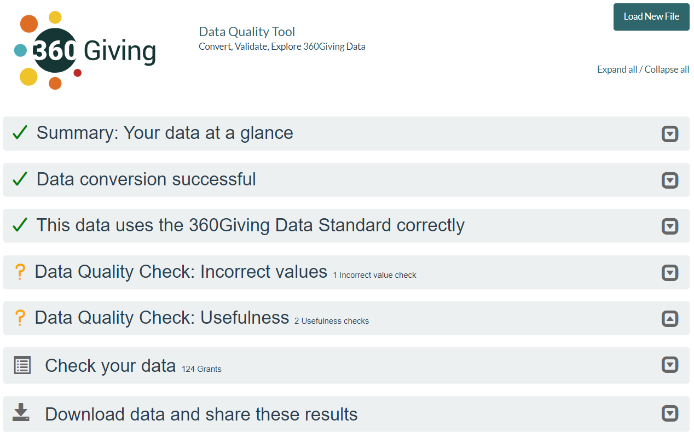

# Check data quality

    <h2 class="box__heading">Key tasks</h2>
    
<ol>
      <li>Upload your prepared 360Giving data into the <a href="https://dataquality.threesixtygiving.org/" target="_blank">360Giving Data Quality tool.</a></li>
      <li>Review feedback and make updates if the data is invalid.</li>
      <li>Check Incorrect values and Usefulness feedback, making updates if required.</li>
      </ol>

## Overview
Once you have prepared your file of grant data, the next step is to check that it is correctly formatted 360Giving data – known technically as ‘valid‘ data – using the <a href="https://dataquality.threesixtygiving.org/" target="_blank">360Giving Data Quality tool.</a> 

The term ‘valid‘ means the file includes the 10 core fields, and the information has all the correct data formatting.

Only valid 360Giving data can be combined with other published data and be included in 360Giving tools, such as <a href="https://grantnav.threesixtygiving.org/" target="_blank">GrantNav</a> and <a href="https://insights.threesixtygiving.org/" target="_blank">360Insights</a>.

## How to use the 360Giving Data Quality Tool
<a href="https://dataquality.threesixtygiving.org/" target="_blank">The Data Quality Tool</a> has been specially designed to support the preparation and publication of 360Giving data.

You can use it by uploading a file or providing a link to a file that is hosted online. 

### Error message
If you get an error message that the DQT can’t process your data, try again using a different file format.

To resolve the issue, resave your data in an accepted file format and try again.

The acceptable files are spreadsheets in OpenDocument Spreadsheet (.ods), Excel Workbook (.xlsx) or CSV (.csv) format or JSON built to the 360Giving JSON schema (.json).

## Understanding the Data Quality Tool feedback

Once you have submitted your file, the screen will display feedback on key information points about the data, divided into up to eight main sections. 
Use the **Expand all/Collapse all** toggle at the top right of the tool or individual arrow icons in the section titles to view the feedback in detail.

The icons for each section provide an initial guide to the quality of your data.

- ❌ **a red cross** indicates warnings or errors. You must resolve these issues before the data can be published and used alongside other valid 360Giving data.
- ✔️ **a green tick** indicates that the file is valid 360Giving data.
- ❔ **an orange question** mark indicates additional checks which suggest ways to improve the quality or usefulness of the data.

### Section 1 - Summary: Your data at a glance
At the top, the summary provides basic details about the file's content – how many grants, recipients, funders and the date range and total value of the grants broken down by currency.

You should review the information in the summary section to check if the results look correct.

If any information in the summary section is wrong, the feedback below will help you investigate what is causing the issues.

Even if the information in the summary section is correct, there may be issues highlighted in the other sections that need to be addressed.

### Section 2 - Data conversion
To test data in a spreadsheet file, the DQT must first convert the data into JSON because 360Giving Data Standard uses a JSON Schema to describe the rules for the Standard in a technical way.

**Please note:** This section will not show if your file of 360Giving data is already in JSON format.

- ✔️ **Data conversion successful** means the DQT could convert the spreadsheet into JSON.
- ❌ **Data conversion unsuccessful** means issues with the data prevented the data from being converted into JSON.

#### Conversion errors
A range of issues can prevent your data from converting successfully.

**Duplicate Identifiers**

All grant Identifiers must be unique, and if two grant records have the same Identifier, the DQT will try to merge the two records. If there are any differences between the two grant records, this will cause an error.

To resolve this error:

- If there are duplicates of the same grant in your file, delete all the duplicates until only a single record for each grant remains.
- If the grants have duplicate identifiers, but they should be different, go back to your source information to check if the wrong identifier has been used and correct it if needed.
- If you have related but different grants that share an identifier in your source information, you need to make these unique in your 360Giving data or merge the information into a single grant record. Add a suffix such as an extra letter or number suffix or the award date to make your grant identifiers unique. For example 360G-ExampleFnd-001A and 360G-ExampleFnd-001B

**Other conversion errors**
Other conversion errors are usually caused by the data not being formatted correctly. These issues are highlighted in the next section, meaning that the conversion errors should disappear when you have resolved all the problems making the data invalid.

### Section 3 - Using the 360Giving Data Standard correctly

For data to be used in 360Giving tools and combined with other 360Giving data, it must meet the requirements of the 360Giving Data Standard. 

- ✔️ **This data uses the 360Giving Data Standard correctly**, which means the data is valid 360Giving data.
- ❌ **This data does not use the 360Giving Data Standard correctly**, which means issues prevented the data from being valid 360Giving data.

The error messages are subdivided into types of issues, with an Error Count to show how many grant records are affected by the problem.
If there are **three or fewer grant records** with the same error, the location of the issue will appear in a preview, with the sheet name and row number for the grant.

If there are **more than three grant records** with the same error, the DQT will also hyperlink to a list in the Error count.

#### Missing fields
These error messages are triggered if your grant records are missing data in the 10 core required fields. If your data does not include data for all 10 core required fields, the DQT will create an error for each missing field, with a count of how many grant records are missing information.

Review the feedback to find where the information is missing and add relevant data to fix these issues. If there is no available data to fill in the missing fields, you may need to remove the grant record from your data until you can add the required information.

**Top tip:** These errors can be triggered by a spelling or formatting mistake in the field title, which means the DQT will not recognise your data as complete. Check the ‘Additional Fields’ section, as this will list all the non-Standard fields in your data and may help you identify the fields that need to be renamed.
Read further information about <a href="https://dataquality.threesixtygiving.org/common_errors#required" target="_blank">Missing field errors.</a>

#### Incorrect Formats
These error messages are triggered if any data formatting is incorrect, most commonly because:

- A date is not in the correct format. 
- An invalid 'URI' has been found, which means there is a problem with a website address in your data.

Read further information about <a href="https://dataquality.threesixtygiving.org/common_errors#date-time" target="_blank">date formatting errors.</a>

Read further information about <a href="https://dataquality.threesixtygiving.org/common_errors#uri" target="_blank">errors with website addresses.</a>

#### Codelist Errors
These error messages are triggered by using codelists incorrectly. Specific fields in the 360Giving Data Standard use codelists, which means you must use one of the pre-defined codelist values when using these fields.

If your data does not use the official codes, the DQT will create an error and list all the values used that are not from the codelist. This issue will also trigger an error in the ‘Other validation errors’ section: Invalid code found in [field name].

Read further information about <a href="https://dataquality.threesixtygiving.org/common_errors#enum" target="_blank">errors with codelists</a> and view the complete list of the [codelists and codes used in 360Giving data](../../technical/codelists/#the-codelists-used-in-the-standard).

#### Other
These error messages are triggered by text data in a field that is <a href="https://dataquality.threesixtygiving.org/common_errors#number" target="_blank">expected to be a number</a> or number data in a field that is <a href="https://dataquality.threesixtygiving.org/common_errors#string" target="_blank">expected to be text.</a>
An error message is also triggered by a minus <a href="https://dataquality.threesixtygiving.org/common_errors#minimum" target="_blank">duration</a> in the **Planned Dates:Duration (months)** field. 
    
The duration of the grant must be in whole months, so it cannot be a minus number. A grant duration can be 0 if the period between the start and end date is less than one month.
    
A minus duration can appear if the duration is calculated from a project or grant start and end date, and there are problems with this data. If the start and end dates have typos, or incorrect dates or the start and end dates are swapped around, this can create a minus duration.
    
### Section 4 - Data Quality Check: Incorrect values
This section highlights areas where your data may need to be corrected or need further attention. For each check, the DQT gives feedback on the issue and the steps to resolve it.
    
Unlike the error messages in the **Data Conversion** and **Using the 360Giving Data Standard correctly** sections, this feedback does not mean your data is invalid. It can be ignored when not relevant or until you can improve your data quality.
    
#### Charity and company numbers
If your charity or company number fields include data other than the numbers (filler text, extra numbers or letters), you will get the following error message: **XX grants have a value provided in the Recipient Org:Charity Number column that doesn’t look like a UK charity number**.
    
If you get this feedback, you will get a similar message about your Recipient Org:Identifier data, because these are created based on the charity or company numbers in your data: **XX grants have a Funding or Recipient Organisation identifier that might not be valid**.
    
To fix these issues, focus on cleaning the data in your system's charity or company number field, and export your 360Giving data again.
    
**Funding or Recipient Org:Identifier that does not draw from a recognised register**
    
Organisation identifiers in 360Giving data follow a specific format, and should either use a prefix taken from the org-id list locator or your publisher prefix which starts **360G-**
    
This feedback highlights any organisation identifiers using unrecognised prefixes, which should be checked and updated as appropriate. See our [guidance on organisation identifiers](../../technical/identifiers/#organisation-identifier) for further help.
    
#### Inverted start and end dates
If you have a minus duration error, you will probably also get feedback that the start and end dates are inverted - **XX of grants have Planned Dates:Start Date entries that are after the corresponding Planned Dates:End Date**.
    
Resolve the validity issues by correcting the dates.
    
#### Zero value grants
If any grants have a zero Award Amount, the feedback will highlight these. Check if these are the result of grants being included that are not yet fully committed and remove if this is the case.
    
#### More than one funding organisation
This feedback will be triggered when the file has more than one unique Funding Org:Identifier.
  
While it is possible for a file to include grants awarded by more than one funder, multiple funding organisation identifiers can sometimes appear in 360Giving data by accident when the org ID is copied in Excel by dragging down the column, which often sequentially adds to the numbers rather than copying the same value.
    
If you get this feedback but you are only preparing data about one funder, update the Funding Org:Identifier so it is consistent.
    
#### Issues with dates
If the data has an Award Date in the future, or planned start or end dates in the far past or far future, the feedback will highlight the affected grants.
    
The grants published should be awarded in the past so post-dated award dates could mean the data is not suitable for publishing yet, or could be the result of errors with the dates.
    
### Section 5 - Data Quality Check: Usefulness
This section highlights ways that your data could be made more useful.  For each check, the DQT gives feedback on a key feature that makes the data useful for analysis, which we recommend including in 360Giving data whenever possible.
    
Feedback is triggered when the following information is missing from the data.

- Recipient location
- Beneficiary location
- Grant programme fields
- Last Modified information
- Data Source
    
Unlike the error messages from **Data Conversion** and **Using the 360Giving Data Standard correctly** sections, this feedback does not mean your data is invalid. It can be ignored when not relevant or until you are in a position to update your data quality.
    
#### grants have a Recipient Org:Identifier that starts '360G-'
    
This feedback is common because, if an organisation doesn’t have a charity or company number or another official reference in the data, the **Recipient Org:Identifier** is created using an internal identifier instead, with the publisher prefix which starts **360G-**.
    
If you do not collect or share charity or company numbers, or any other official organisational references, you will see this error for all your grants. It is strongly advised that you begin to collect and share this data wherever possible, as this makes it more useful and comparable.
    
If you do collect and share charity or company numbers, or other official references, then the percentage of grants with **360G-** type **Recipient Org:Identifiers** should broadly match the proportion of grant recipients which are small and unregistered groups, or do not have official identifiers in reality.
    
If the proportion of grants with an internal identifier is higher than you would expect, you should investigate further.
    
If you also receive the feedback **grants do not have either a Recipient Org:Company Number or a Recipient Org:Charity Number** and there is a significant mismatch between the proportion of grants without a charity and company number and the proportion of **360G-** type org IDs, this may also point to an issue with your data.
    
### Section 6 - Additional Fields
This section only appears if your data includes fields which do not use 360Giving Data Standard titles. The titles of these additional fields will be listed in this section.
    
Many 360Giving publishers have additional fields in their data, which is welcomed. However, this section will help you check that all the additional fields are included intentionally and are not the result of spelling or formatting mistakes in the title that is meant to correspond to a 360Giving Data Standard field.
    
### Section 7 - Check your data
This section provides a basic preview of your data in a table to allow you to review the information in the tool.

There is also a count of the grant, funding organisation and recipient identifiers which hyperlink to a list view.
    
**Top Tip:** If you are testing grant data for a single funder, but the summary says there is more than one unique funding organisation identifier, you can check these values in the list view.
    

### Section 8 - Download data and share these results
    
#### Share
In this section, you can get the unique URL for the test results, which allows you to share the feedback with others. The link will last for seven days, after which it will expire.
    
If your data is not suitable for sharing publicly, then you should treat this URL with care. Only share it with people who have permission to access the data in its current form.
    
#### Download
In this section, you can download a version of your spreadsheet file converted into JSON format.
    
If the file you have been testing is already in JSON format, you can instead select **Convert to Spreadsheet** in the summary section to create an Excel spreadsheet version of the file to download.
    
### Getting more help
Please contact the 360Giving Helpdesk via <support@threesixtygiving.org> if you have questions about using the Data Quality Tool or the feedback you receive.
    
The 360Giving Helpdesk can also look at the data you are preparing to check and provide further feedback prior to publishing your data for the first time.
    
## Once the data passes the checks
Once your file has three green ticks, it means the information is valid 360Giving data.
    

Passing the Data Quality Tool checks means the file is ready for use, including in platforms such as <a href="https://grantnav.threesixtygiving.org/" target="_blank">GrantNav</a>.
    
**Please note:** The tool cannot check the content of the data. Further checks may be needed to ensure the information is accurate and that the data does not include information unsuitable for publishing as open data.

    <h2 class="box__heading">Data protection</h2>
    
Find out more about what to check before publishing your data openly in our <a href="../../guidance/data-protection" target="_blank">data protection guidance.</a>

    
### About Data Quality Tool security
The Data Quality Tool has been designed to support people preparing their 360Giving data, meaning the data inputted into it is in varying stages of readiness.
    
The feedback report you receive has a private URL, which means only those with the link can access the page and the data. If your data is not suitable for sharing publicly, then you should treat this URL with care and only share it with people who are allowed access to the data. As long as you do not put the URL on a public page, then it will not be possible for people to come across it by accident.
    
The files are deleted automatically from the Data Quality Tool after seven days. Read the <a href="https://dataquality.threesixtygiving.org/" target="_blank">More information</a> section on the tool's homepage and the <a href="https://dataquality.threesixtygiving.org/terms/" target="_blank">Terms and Conditions</a> for further details about how the files are stored and deleted.
    
### What‘s next?
Read our guidance about publishing your grant data openly to make it available for anyone to download and use.
