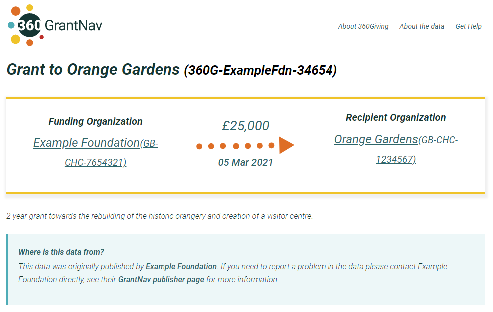
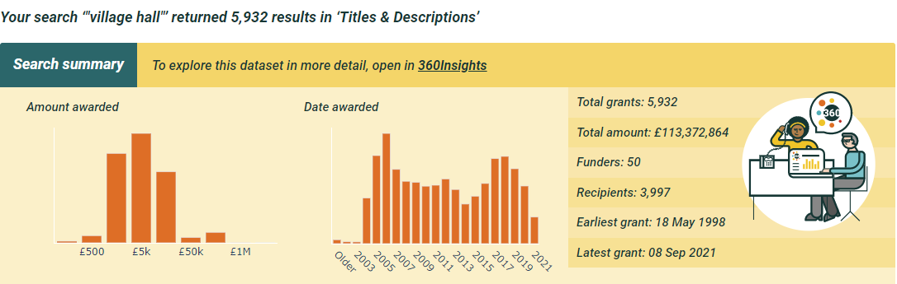
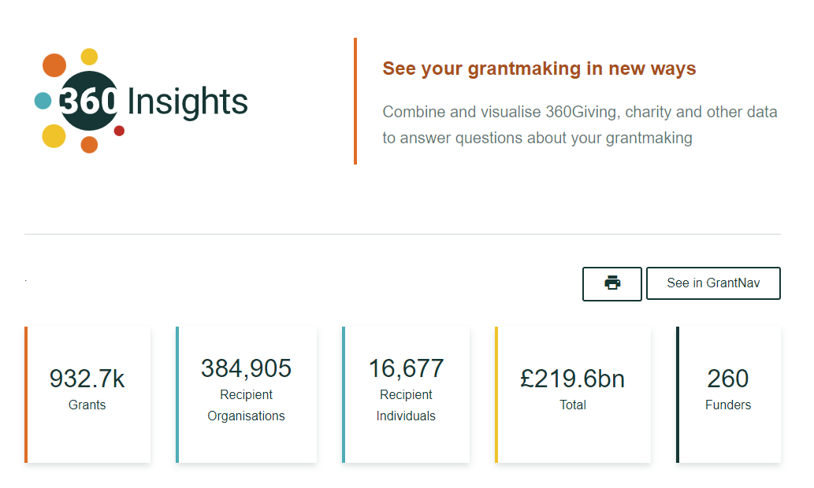

# Plan your process and data
<div class="box box--teal">
    <h2 class="box__heading">Key tasks</h2>
    <p><ol>
      <li>Decide what information to publish – the scope of the fields, what time period your data will cover and whether you will be sharing data about all of your grants.</li>
      <li>Check if there are any Data Protection and Privacy considerations, and review your policies to ensure you can share your data responsibly</li>
       </ol></p></div>

## How long the process takes
The amount of time it takes to prepare and share 360Giving data can vary depending on your circumstances. The key factors that can determine how long the process will take are:
- The type of grants management system used
- The amount of data to be published
- Whether the data is well-organised and consistent
- If key data is poor quality or missing

It will normally be possible to estimate the work involved once you have decided on the scope of your data.

## Decide what information to share
The full 360Giving Data Standard is comprehensive, with over 100 fields available to describe information about grants, recipients and funding organisations, programmes, locations and more.

There are **10 core fields** of information which all 360Giving data must include. These fields ensure that the data will be usable and describe the **who, what, when and how much** of each grant.

### 10 core fields
360Giving Data Standard can be used to publish data about grants awarded to **organisations** or **individuals**.

Eight of the 10 core fields are consistent for all types of grantmaking:
- Identifier
- Title
- Description
- Currency
- Amount Awarded
- Award Date
- Funding Org:Name
- Funding Org:Identifier

The remaining two required fields are different depending on whether the recipient of the grant is an organisation or an individual.

If the recipient is an organisation:
- Recipient Org:Identifier
- Recipient Org:Name

If the recipient is an individual:
- Recipient Ind:Identifier
- Recipient Ind:Name

<div class="box box--teal">
    <h4 class="box__heading">Hint</h4>
    <p>Seven of the 10 core fields are commonly collected as part of the grantmaking process, and may be stored in a grants management system. Three pieces of information are usually added as part of the data preparation process: Funder name; Funder identifier and Currency</a></p></div>

#### Grants to individuals and data protection
The fields are titled **Recipient Ind:Identifier** and **Recipient Ind:Name**, however the data shared about individual recipients is expected to be anonymous, with no personal data included that could allow the recipient to be identified.

#### Recommended fields
Apart from the 10 core fields, all other fields are optional. However the majority of publishers do share a range of further information which make the data more useful and help users to understand their grantmaking better.

If the **recipient is an organisation**, the following types of information are commonly shared.
- Charity and company numbers
- Recipient location
- Beneficiary location
- Grant duration and/or planned start and end dates
- Grant programme details
- Metadata

You can be pragmatic when making these choices. If you have this recommended information available, then consider including it.

If you don’t collect certain data or the information is not relevant to your grantmaking, these fields can be left out of your 360Giving data. For example not all funders have programmes, and location information may not be relevant to grants awarded for policy or research.

It is possible to start by publishing simpler information and then extend the range of fields you include over time.

#### Further information about core and recommended fields
You can view and download further details about the core, recommended and optional fields for **funders of grants to organisations** in the <a href="https://docs.google.com/spreadsheets/d/1klj0PzxrlnBPhodpEQC7tD6aRNuEjVNeNHVRvIv66b4/edit?usp=sharing" target="_blank">Notes about the 360Giving Data Standard</a> (link opens in Google Sheets).

For further information about **Recipient location**, **Beneficiary location** and **Location scope** fields visit the [360Giving guide to location data.](../guidance/location-guide)

You can find further information about the core and recommended fields and codelists for sharing information about **grants to individuals** in our [Field guidance.](../../individuals/publisher-guidance/#field-guidance)

For further information about all the possible fields in the 360Giving Data Standard, visit the [Technical Reference section.](../technical/reference) 

#### Additional fields
If you have information that doesn’t fit any of the 360Giving Data Standard fields provided, you can include these in additional fields. 

A file of 360Giving data can include any number of these **non-Standard** fields, however you will need to take care with the titles and make sure the data formatting is consistent.

For guidance on naming your own fields, visit the [Additional fields section.](additional-fields)

```eval_rst
.. _decide-what-grants-to-include:
```

## Decide what grants to include
360Giving is a voluntary initiative and you can decide what information to share in your open grants data, based on what is appropriate to your circumstances. 

The majority of 360Giving publishers data about all their grants, but there are examples of those who share data about certain programmes, or only grants over a certain value.

If your goal is to publish data about all your grants but you find there are practical or policy issues to address first, work out which grant programmes or grants are unaffected by these barriers, and move forward with publishing these. The learning from this process can then be applied to other areas of your grantmaking once the issues are resolved.

### Decide whether to share historical grant data
You can publish data going as far back as you want (and have data for) or focus on sharing information about recent grants.

Some funders have published many years of historical data, while others have started by sharing data about the past year or recent grant award rounds. The decision about how much historical data to share is often informed by practical considerations.

These questions will help you to decide.
- How accurate and complete is the data in your systems?

If there are gaps or inaccuracies in your older data, then start from a point where you are confident in the quality of the information.

- Is your past grantmaking similar to your current funding priorities?

If your historical grant awards are not representative of what you fund now, you may prefer to start from the beginning of your most recent grantmaking strategy.

The more grant data you can share, the greater the benefit to users of 360Giving data. However, if you start by publishing recent grants, you can decide to include more historical data at a future point.

<div class="box box--teal">
    <h3 class="box__heading">Data protection</h3>
    <p>Once you have decided the scope of the information you want to share, it is important to carefully consider if there are any privacy or data protection implications to publishing your grant data.</p><p>The data protection requirements and steps that need to be taken to ensure grants data can be shared responsibility are different for funders of grants to individuals than they are for funders of grants to organisations.</p><p>Read our guidance on data protection for <a href="../../guidance/data-protection" target="_blank">funders of grants to organisations</a> or <a href="../../individuals/publisher-guidance/#data-protection" target="_blank">funders of grants to individuals</a>.</p></div>

## Taking inspiration from others
You may find it helpful to look at the data published by other funders to understand how it works in practice and help you to picture how your own grants would appear.

#### Data Quality Dashboard
<a href="https://qualitydashboard.threesixtygiving.org/" target="_blank">The Data Quality Dashboard</a> shows the data quality of 360Giving data as a whole and for each individual publisher. It provides insights into the key features that make the data useful for analysis to help publishers to identify opportunities for their data to be improved.


#### GrantNav
<a href="https://grantnav.threesixtygiving.org" target="_blank">GrantNav</a> is our search engine for grants data. Explore and download data about where funding goes and how much is given across billions of pounds of grants, for causes and locations across the UK.

Each GrantNav grant record has its own page with the 10 core fields showing at the top with other fields that have been shared displayed in a table below.



As well as looking at a single grant record view, you can view lists:
- <a href="https://grantnav.threesixtygiving.org/org/GB-CHC-219278" target="_blank">Grants awarded to a particular organisation</a>
- <a href="https://grantnav.threesixtygiving.org/district/Shropshire" target="_blank">Grants to recipients located in a particular place</a>

You can also search the data by keyword. For example, this search shows grants awarded with the <a href="https://grantnav.threesixtygiving.org/search?query=%22village+hall%22&default_field=title_and_description" target="_blank">term ‘village hall’ in the grant title or description.</a>

You can filter your results by grant size, date, location, grant programme, funder, funder type and recipient. You can also download the results of any searches or open the results for searches with under 10,000 grants in <a href="https://insights.threesixtygiving.org" target="_blank">360Insights.</a>



For more guidance about how to explore 360Giving data in GrantNav visit the <a href="https://help.grantnav.threesixtygiving.org/en/latest" target="_blank">GrantNav Help site.</a>

#### GrantVis
<a href="https://grantvis.threesixtygiving.org" target="_blank">GrantVis</a> is a tool to help you understand funders better. You can combine and visualise 360Giving and charity data, and explore funders across different areas – from their grant dates to types of recipients.

You can filter the 360Insights dashboard to see results for grants based on grant programme, organisation type, size or region.



### What's next?
Read our guidance about data protection aimed at funders of grants to organisations and what to consider when publishing open grants data for the first time.


