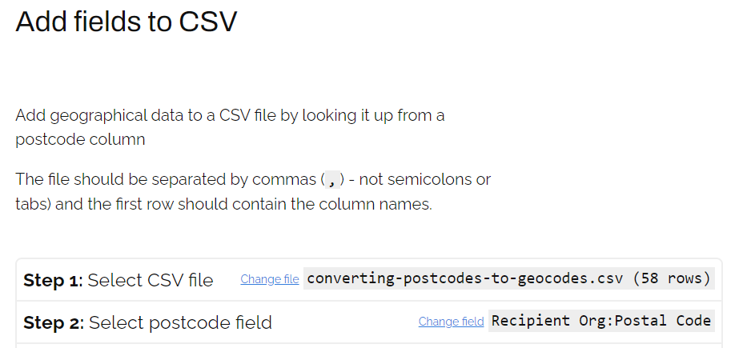

# Prepare and format your data

    <h2 class="box__heading">Key tasks</h2>
    
<ol>
      <li>Register with 360Giving Helpdesk.</li>
      <li>Decide whether to publish using spreadsheet or JSON file format.</li>
      <li>Choose a data preparation method, informed by your grants data management systems.</li>
      <li>Decide whether to publish Metadata about your 360Giving data.</li>
      <li>Check that your prepared data passes the 360Giving Data Quality Tool checks.</li>
      </ol>

### Overview
By the end of this stage you will have prepared your grant data ready for publishing, and have tested that the file is formatted correctly in the 360Giving Data Quality tool. 

How you prepare your data will be influenced by how you collect and store information about your grants.

For many publishers preparing data is a manual process which involves exporting data from a grants management system and converting it into a spreadsheet. However, some grants management systems have some or all of the steps needed to convert the information into 360Giving data built-in to the system. 

## Register with 360Giving Helpdesk
Once you have decided to publish your grants data, please let us know by emailing the 360Giving Helpdesk via <support@threesixtygiving.org>. 

You will be provided with a **360Giving Publisher prefix**, which identifies your organisation and will be used in your 360Giving data to provide a unique identifier for each grant. For further information see our guidance about [grant Identifiers.](https://standard.threesixtygiving.org/en/new-docs-style/identifiers/#identifiers)

## Choosing your file format
There are two file formats available for publishing 360Giving data, spreadsheets and JSON.

### Spreadsheet format
Spreadsheets are the most common way for publishers to share their data – the majority of 360Giving data files are spreadsheets. Acceptable file formats are CSV (.csv), Excel Workbook (.xlsx) or Open Document (.ods). Is it not possible to publish in older Excel file formats (.xls).

You do not need specialist technical knowledge or specialist software to use spreadsheet file formats to publish. 

### JSON format
JSON format is used for exporting the data directly from a grants management system or database, using the 360Giving JSON schemas. Some specialist technical knowledge is needed to use JSON to publish 360Giving data.

Check the [technical reference](https://standard.threesixtygiving.org/en/new-docs-style/technical/reference/) for further details and look at examples of JSON files available via the 360Giving Data Registry. Please note that using JSON format involves publishing the data in a JSON file; there is no API. 

If you decide to use the JSON file format to publish your data you will likely need support from a developer to set this up. Contact the 360Giving Helpdesk via <support@threesixtygiving.org> to discuss your next steps for using JSON as your publishing format. 

## Publishing using spreadsheets
For most publishers, whether you are using grants management software or you hold your grants data in spreadsheets, the practical steps to get your data ready will be similar and involve making changes to the data in the file. For funders using configurable CRM systems, such as Salesforce, as a grants management system to can be possible to build in 360Giving publishing processes.

### Funders without a grants management system
There are 360Giving publishers without a database or grants management system who collect their grants information in simple spreadsheets. The steps to prepare your data will be similar to most other publishers.

However if you don’t currently collect information about your grants, you will need to start gathering that data in order to publish it using the 360Giving Data Standard. 

Depending on what range of information you want to start collecting, you can set up your own spreadsheet, fill out an adapted version of the 360Giving Spreadsheet Template or collect your data in a 360Giving Conversion Tool template. For further details see the options for publishing using a spreadsheet section [below.](https://standard.threesixtygiving.org/en/new-docs-style/prepare-data/#options-for-publishing-using-a-spreadsheet)

### Funders with a grants management system
If you use a grants management system provided by a software company it is unlikely that you will be able to build in 360Giving publishing into the system itself. However you should be able to set up and save a report to export the source information for your 360Giving data and convert it into the right formats in a spreadsheet.

Funders using a range of proprietary grants management systems have shared 360Giving data, including:
- Blackbaud Grantmaking
- Flexi-grant
- Benefactor
- CC Grant Tracker
- SmartSimple

If you use Salesforce as a grants management system, it is possible to build-in 360Giving publishing. Many funding organisations who use Salesforce have set up their system to make sharing 360Giving data more straightforward. Read our further guidance about setting up Salesforce to publish 360Giving [below.](https://standard.threesixtygiving.org/en/new-docs-style/guidance/prepare-data/#setting-up-salesforce-for-360giving-data-publishing)

It can also be possible to build-in 360Giving publishing into other types of configurable CRM systems - such as Microsoft Dynamics. Contact the 360Giving Helpdesk via <support@threesixtygiving.org> with questions about how your grants management system will impact your 360Giving publishing process.

## Options for publishing using a spreadsheet
- Start with an empty file and construct the column titles by referring to the 360Giving Data Standard [technical reference.](https://standard.threesixtygiving.org/en/new-docs-style/technical/reference/) 
- Use the ‘360Giving Spreadsheet Template’ and adapt this to your needs.
- Configure and use a 360Giving Data Conversion Tool Template, a method used by a wide range of funders.

### Using the 360Giving Spreadsheet Template
This multi-sheet spreadsheet template consists of all the fields in the 360Giving Data Standard. 

There is a main ‘grants’ sheet which includes the 10 core fields and other common data fields. Additional sheets allow for the sharing of further information. 

You can download the 360Giving Spreadsheet Template [here.](https://standard.threesixtygiving.org/en/latest/reference/#spreadsheet-format)

#### Making changes to the 360Giving Spreadsheet Template
You can adapt the template to suit your needs and make changes to:
- Remove non-required columns that you are not using.
- Reorder the columns so that information is arranged in the way you want.
- Move columns in the template between sheets.
- Add extra columns to include information you want to share that is not covered by the 360Giving Data Standard fields. See our guidance on Additional fields for further details.

However, all the columns in your adapted template must use the correct headings and data formatting to ensure your data conforms to the 360Giving Data Standard. It must also include all of the 10 core fields

#### Filling out the template
The 10 core fields must be filled in so that there is no missing information. 

For all other columns, if information is not available the field should be left blank. Do not use dashes (-) zeros (0) or N/A to fill in blank fields as this will make your data harder to use.

#### Working with more complex information
The majority of publishers using spreadsheets will detail all the information about each grant on one row of a spreadsheet. 

However it is possible to include more complexly structured data if needed. For example if a single grant has multiple beneficiary locations, it is possible to represent this by creating ‘One to many relationships’.

See our guidance for further information about [One to many relationships.](https://standard.threesixtygiving.org/en/new-docs-style/reference/#one-to-many-relationships)

### 360Giving Conversion Tool Template
A 360Giving Conversion Tool is an Excel file designed to make the technical steps of formatting grant information into 360Giving data more straightforward. The tool can be set up to work with the range of data you choose to share with support from the 360Giving Helpdesk. 

Although each tool is tailored to each funders’ data and needs, they are all set up in the same way, with at least three sheets:

- **source_data**
This sheet is for the grant information that needs to be formatted as 360Giving data. The source data is copied and pasted from a file exported from your grants management system or an existing file that holds your data.

- **fixed_data**
This sheet is for the ‘fixed’ information that is needed to create your 360Giving data. These are unlikely to be in your source data, such as the currency, your own organisation name, organisation identifier and Publisher prefix.

- **360_data**
In the top row of this sheet are the 360Giving headers that align with the data you intend to publish. From the second row, there are a range of formulas which combine the source data and fixed data from the first two sheets to create 360Giving formatted data. 

By using formulas to convert the data, it means any changes in content of the data in the **source_data** or **fixed_data** sheets will automatically be picked up in the 360_data sheet.

Conversion tools have been set up to work with data exported from a range of grants management systems, including all the systems listed [above.](https://standard.threesixtygiving.org/en/new-docs-style/guidance/prepare-data/#funders-with-a-grants-management-system)

To find out about whether using a conversion tool would be appropriate for your organisation, please contact the 360Giving Helpdesk via <support@threesixtygiving.org>.

## Setting up Salesforce for 360Giving data publishing
Some Salesforce grantmaking systems that are managed by consultants and have basic 360Giving data exporting functions built-in, so check with your Salesforce administrator or technical support provider to find out if this is the case for your organisation. Even with this built-in functionality there will be extra steps to customise your system to allow you to export the full range of fields you have decided to publish.

If you manage your own Salesforce system, you can either get support from a Salesforce consultant or set up a custom 360Giving report yourself. 360Giving has step-by-step guidance on how to set up a custom 360Giving report and can provide practical assistance to help you configure your system. 

Contact the 360Giving Helpdesk via <support@threesixtygiving.org> to discuss your options for setting up your Salesforce grants management system for 360Giving publishing.

### Guidance for community foundations
If you are a community foundation using the Digits2 grants management system in Salesforce, please refer to our special guidance about the built-in 360Giving data extract tool.

The guide includes a video walk-through and step-by-step instructions on how to export 360Giving-formatted data from your Digits2 system.

    <a href="https://standard.threesixtygiving.org/en/new-docs-style/guidance/cf-guidance/" class="button button--teal">Read more</a>

## Metadata: making your data more usable
The 360Giving Data Standard allows funders to describe information about their grants, and provide information about the organisations and programmes related to these awards.

It is also possible to publish data about the data itself. This is called **metadata**.

Metadata is data about the data, such as the size of a file, how many grants it contains and when it was published. Metadata is important to help understand more about the data and how it might be useful in a particular case.

### Including metadata in your 360Giving file
The metadata fields in the 360Giving Data Standard allow for the publication of authoritative metadata. Including metadata allows you as the publisher to ensure key information is provided to the users of your data. It is especially useful if you need to provide additional context or add disclaimers about your organisation or the grant data in the file. 

See our [guidance on metadata](https://standard.threesixtygiving.org/en/new-docs-style/technical/reference/#meta-sheet) for further details.

For publishers sharing their data in JSON file format, the metadata is included in the Package Schema. See our guidance on [the Package schema](https://standard.threesixtygiving.org/en/new-docs-style/reference/#giving-json-schemas) for further details.

## Converting Postcodes into Geocodes to anonymise address information
Converting postcode data into geocodes protects the privacy of recipients while allowing you to include useful data that will allow your grants to be geolocated. The practical process may vary depending on the process you use for preparing your 360Giving data and the volume of data.

Geocodes can be found using the <a href="https://findthatpostcode.uk/" target="_blank">Find that Postcode website.</a>

Firstly, use the search on the homepage. You can enter a postcode and get details of the full range of geocodes associated with that location, for example these are the results for the <a href="https://findthatpostcode.uk/postcodes/N1%209AG.html" target="_blank">London postcode N1 9AG</a>. 

You can then decide which type of geocode to include in your data. 
- Some publishers use either **Local Authority** or **Ward** areas for recipient location, as these types of geocodes work with <a href="https://help.grantnav.threesixtygiving.org/en/latest/#location_data" target="_blank">GrantNav’s location filtering functions.</a> 
- Place-based funders, such as community foundations, often use smaller areas such as the **Lower Super Output Area**, to provide information about the grant location.

If you’re preparing a small number of grants at a time then manually searching to get the relevant codes and adding these into your data at the data preparation stage could be a straightforward approach.

### Using Postcode to Geocode lookup tool
Find that Postcode has a <a href="https://findthatpostcode.uk/addtocsv/" target="_blank">'Add fields to CSV'</a> service which means you can upload a list of postcodes into the tool and then download a file with all the geodata you’ve chosen to use.

If you have a batch of postcodes to convert to geocodes, the practical steps might involve: 

1\. Prepare your 360Giving data including a column with the relevant postcode data.

2\. If using Excel, convert this file into CSV format. See this guidance for further details of <a href="https://support.microsoft.com/en-us/office/import-or-export-text-txt-or-csv-files-5250ac4c-663c-47ce-937b-339e391393ba" target="_blank">how to convert a file between Excel Workbook and CSV.</a>

3\. Upload this file into the 'Add fields to CSV' service at <a href="https://findthatpostcode.uk/addtocsv/" target="_blank">https://findthatpostcode.uk/addtocsv/</a>

4\. Select the field that includes your postcode data.

5\. Select the geocode types you want added to your file. Latitude/Longitude, Region and Local Authority are selected by default so can be unticked if not required.

6\. Click the 'Add data to CSV' button at the bottom of the page. The tool will automatically download an updated version of your file with geocodes included.

7\. Delete the column of postcode data from this version of the file.

8\. Rename the new columns to match the 360Giving Data Standard. For example if using Ward codes the headings should be renamed as follows:

Ward Code = Recipient Org:Location:Geographic Code

Ward Name = Recipient Org:Location:Name
  
9\. Re-save as Excel file (xlsx file format).

### What's next?
Read our guidance to find out how to check your data using the 360Giving Data Quality Tool.

