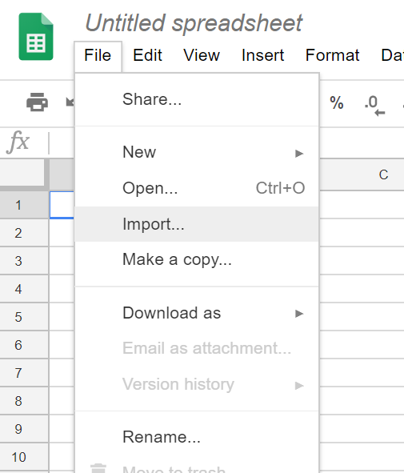
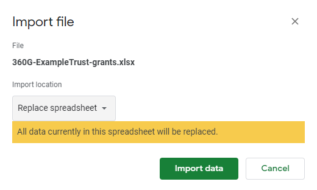
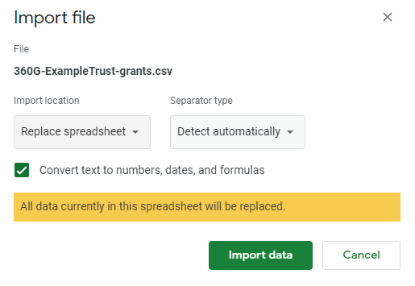
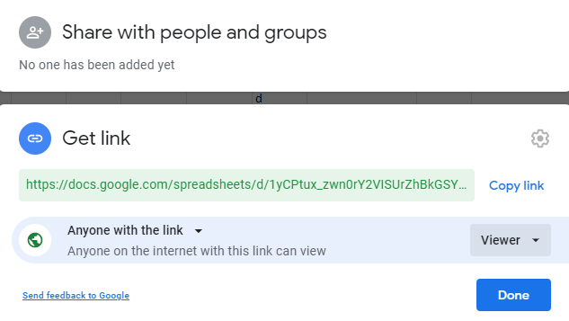

# Publish your data openly

<div class="box box--teal">
    <h2 class="box__heading">Key tasks</h2>
    <p><ol>
    <li>Decide what open license to use.</li>
      <li>Select a location online to host your data.</li>
      <li>Publish your 360Giving data file alongside the details of the open license.</li>
      <li>Let 360Giving know about your file so it can be added to the <a href="https://data.threesixtygiving.org/" target="_blank">360Giving Data Registry.</a></li>
       </ol></p></div>

## Overview
At the beginning of this stage you should have a file of 'valid' 360Giving data that has passed the <a href="https://dataquality.threesixtygiving.org/" target="_blank">360Giving Data Quality tool</a> checks and is ready to be published. By the end of this stage you will have published your grant data as open data, making it available for anyone to download and use.

## How to make your 360Giving data open
Data published to the 360Giving Data Standard is open data, which means the information is available to everyone to use and share for any purpose. For further information visit the <a href="https://opendefinition.org" target="_blank">Open Definition website.</a>

### Choose an open license
While there are several choices for open data licenses, we recommend a license that does not restrict use but does acknowledge you, the publisher. 

To this end, our default recommendation is the Creative Commons Attribution 4.0 International (CC BY 4.0). With this license, anyone can share or adapt your data for any purpose, even commercially. The only restrictions are that they must give appropriate credit, provide a link to the license, and note any changes made. 

Find out more about the <a href="http://creativecommons.org/licenses/by/4.0/" target="_blank">CC BY 4.0 license.</a> 

#### Open license for the public sector
If you are a UK public sector organisation, you should use the Open Government License. This is the UK government’s open data license which public sector bodies are encouraged to use by the <a href="https://ico.org.uk/for-organisations/guide-to-rpsi/" target="_blank">Re-use of Public Sector Information Regulations 2015 (RPSI).</a>

Find out more about the <a href="http://www.nationalarchives.gov.uk/doc/open-government-licence/version/3/" target="_blank">Open Government License 3.0.</a>

#### Why 360Giving data is openly licensed
Without a license, data is not open data and potential users would not know what they are allowed to do with it.

Providing your 360Giving data under an open license is a straightforward way to let users know that they have permission to use the data, as well as any conditions of use.

- The licenses are free to use so there is no charge associated with openly licensing your 360Giving data.
- To use an open license you include the details of the license you are using alongside the link to your 360Giving data file, as shown in the example open license statement.

#### Example open license statement
Here’s an example of a license statement based on our recommended CC BY 4.0 license. Simply replace the words in square brackets with information about your organisation and grants.

> **[Organisation]** is committed to transparency and we work with 360Giving to publish information about our grants.
> Using the 360Giving Data Standard, our awarded grants since **[Year]** are available as **[File Type]** here.
> This work is licensed under the Creative Commons Attribution 4.0 International License. To view a copy of this license, visit http://creativecommons.org/licenses/by/4.0/. This means the data is freely accessible to anyone to be used and shared as they wish. The data must be attributed to **[Organisation]**.

> We believe that with better information, funders can be more effective and strategic decision makers. 360Giving supports funders to publish open data about their grants, and empowers people to use this data to improve charitable giving through a range of free online tools. For more information, visit https://www.threesixtygiving.org

## How to host your 360Giving data
The final step is to prepare a place online where your 360Giving data file will be available for download. For most 360Giving publishers this means hosting the data on their website but there are also some alternative hosting methods that can be used.

### Hosting your 360Giving data on your website
It is best practise for organisations publishing data to the 360Giving Data Standard to host their files on their own website. This means they have control over, and are responsible for, their own data.

You can host the data file anywhere on your site and place a link to it where it can be easily found.
- You could create a dedicated “open grants” section/page on your website.
- You could link to your data file from an existing page which shares information about your grants awarded, or alongside your annual report.
- Or you can choose another place which makes sense for your website’s structure.

#### Using the 360Giving logo
If you would like to use the 360Giving logo on your website, there is a <a href="https://www.threesixtygiving.org/360giving-badges/" target="_blank">special design that publishers can use.</a>

Please do not use the main 360Giving logo without permission.


#### Example hosting pages
Here are some examples of what other 360Giving publishers have done.

Linking 360Giving from an existing webpage:
- <a href="https://abcharitabletrust.org.uk/grantees/grants-awarded" target="_blank">A B Charitable Trust</a> 
- <a href="https://www.friendsprovidentfoundation.org/grants/our-approach-to-funding/" target="_blank">Friends Provident Foundation</a>
- <a href="https://www.jlc.london/grants/recent-grants/" target="_blank">John Lyon’s Charity</a>
- <a href="https://virginmoneyfoundation.org.uk/grants-awarded/" target="_blank">Virgin Money Foundation</a> 

Linking 360Giving data from a dedicated open data page:
- <a href="http://andrewlloydwebberfoundation.com/360-giving" target="_blank">Andrew Lloyd Webber Foundation</a>
- <a href="https://www.bbcchildreninneed.co.uk/grants/bbc-children-in-need-360-giving/" target="_blank">BBC Children in Need</a> 
- <a href="https://www.citybridgetrust.org.uk/360-giving/" target="_blank">City Bridge Trust</a> 
- <a href="https://tudortrust.org.uk/who-we-are/open-data" target="_blank">Tudor Trust</a> 

### Data hosting for public sector organisations
Some local authorities can have dedicated open data portals for hosting information published by the council or about the local area, which are ideal places to host 360Giving data.

Alternatively, public sector organisations may be able to use the central <a href="https://data.gov.uk/" target="_blank">data.gov.uk</a> website to host their 360Giving data.

Examples of public sector data hosting pages:
- <a href="https://data.london.gov.uk/dataset/gla-grants-data" target="_blank">Greater London Authority</a> 
- <a href="https://data.hounslow.gov.uk/dataset/grants-to-the-vcse-sector" target="_blank">London Borough of Hounslow</a> 
- <a href="https://data.gov.uk/dataset/0a88d123-6f82-45f3-a89a-6a44e6e8bf89/stockport-local-fund" target="_blank">Stockport Metropolitan Borough Council</a> 

## Register your file with 360Giving
Once your 360Giving data file is published, the final step is to let us know so we can add a link to the file from the <a href="https://data.threesixtygiving.org/" target="_blank">360Giving Data Registry.</a>

The 360Giving Data Registry is a list of all the organisations that currently publish their grant data in the 360Giving Data Standard, with direct links to their data sources. Anyone can access the Registry to view, download and use the data.

The files listed on the 360Giving Data Registry are the source for the data in GrantNav, 360Insights and other tools and platforms using the data.

### When your grants will appear in GrantNav and 360Insights
In order for data to be included in 360Giving tools, the data needs to meet these three criteria:
- Listed on the 360Giving Data Registry;
- Openly licensed;
- Valid according to the schema used for the 360Giving Data Standard.

**GrantNav** is updated on a daily basis. This means your data will appear there the day after a file is added to the Data Registry.

**360Insights** takes up to 48 hours to update. This means your data will appear there two days after a file is added to the Data Registry.

```eval_rst
.. _alternative-hosting-options:
```

## Alternative hosting options
It is best practice for organisations to host their own data, so the ownership of the information is clear. This gives you full control over the file so you can make changes and updates whenever you need to. 

However, for organisations without a website or without capacity to create a place to include the data, it is possible to use alternative hosting and open licensing arrangements. These are described below.

### Include open licensing information into your 360Giving data file
If you can upload the 360Giving file into the backend of your website but cannot add the license text to a public page – in the short or longer term – you can include the open license information within the file itself using the Metadata sheet (or Package Schema if you are using JSON file format to publish). 

Please see our [guidance about metadata](meta-sheet) for further information.

### Hosting your data using cloud storage
Below is a step by step guide to using two file sharing services to host 360Giving data; Google Drive and Dropbox. 

### Google Sheets
Google provides users with the Google Drive service, offering 15GB of space for free. 

To share a 360Giving data file using Google Drive, it must first be converted to a Google Sheets document.

1\. On your Google Drive, create a new Google Sheets document (select New > Google Sheets). 

2\. Import your 360Giving Excel or CSV file to the Google Sheets (select File > Import > Upload, and select the file from your computer or drag-and-drop). 





3\. If you are using an **Excel file** choose ‘Replace Spreadsheet’ and click Import data. 





4\. If you are using a **CSV file** choose ‘Replace Spreadsheet’ as your import option. Choose Separator type as ‘Detect automatically’ and answer ‘Yes’ to Convert text to numbers and dates and click Import data. 





5\. If included in your data check the **Recipient Org:Charity Number** and **Recipient Org:Company Number** columns. Google Sheets will sometimes interpret these columns incorrectly and place decimal points into them. There is a simple fix by selecting the whole column (click the column letter) and then using the menu to select Format > Number > Plaintext. 


6\. You can rename the file with your prefered title with File > Rename. 

7\. Share your file so that it is publically accessible to anyone with the link (select Share and select Get Shareable Link). Select the Link Sharing option ‘On - anyone with the link can view’. 





8\. Copy this link, which will resemble the following example: 

https://docs.google.com/spreadsheets/d/1gyyHFzS60yrMqindaaTNW8kSFa0sOIZAjDIR8sZ5dLA/**edit?usp=sharing**

9\. Change the end of the link to **export?format=xlsx** so that it resembles the following: 

https://docs.google.com/spreadsheets/d/1gyyHFzS60yrMqindaaTNW8kSFa0sOIZAjDIR8sZ5dLA/**export?format=xlsx**

10\. Copy this newly-formatted link and test that your data is still valid using the <a href="https://dataquality.threesixtygiving.org" target="_blank">360Giving Data Quality Tool.<a/>
  
11\. Contact 360Giving Helpdesk via <support@threesixtygiving.org> to get the link added to the Data Registry. 

It is best practice to keep your published data in this single Google Sheets document. If another Google Sheets document is created, the link will be different and therefore need to be changed in the 360Giving Data Registry. To replace a current Google Sheets document with an updated Excel or CSV file of 360Giving formatted grants data follow Steps 2 and 3 or 4, above. This imports a new Excel or CSV file and replaces the data currently there. 

### Dropbox 
Dropbox provides users with a Basic account, offering 2GB of space for free. 

The process of sharing 360Giving data files through Dropbox is straightforward.

1\. Upload the file to your Dropbox account, storing it in whatever folder you find useful.
  
2\. Share the file by creating a shared link for view-only access (anyone with the link can view the file, but can’t alter it).
  
3\. Copy this link. It will resemble the following example: 
    
https://www.dropbox.com/s/ju3b1wne41xbowy/360Giving-dataset.xlsx?**dl=0** 
  
4\. Change the ending of this from **'dl=0'** to **'dl=1'**, eg:
    
https://www.dropbox.com/s/ju3b1wne41xbowy/360Giving-dataset.xlsx?**dl=1** 
  
5\. Copy this newly-formatted link and test that your data is still valid using the <a href="https://dataquality.threesixtygiving.org" target="_blank">360Giving Data Quality Tool.<a/>
  
6\. Submit the link to 360Giving Helpdesk via <support@threesixtygiving.org> to be added to the Data Registry. 

Be aware that this link can easily be changed (by being deleted and re-created) and therefore will become invalid. If this happens you will need to let the 360 support team know the new link to your data.

## Good practice in file management
360Giving publishing is all about files - it’s how data is shared and gets updated. This means it is important to consider your approach to file management.

### Publishing in single or multiple files
Some organisations publish all their data in a single file while others split their grants data into separate files by year or grant programme.
    
Your choice might be influenced by a range of factors:
- If you will be making regular updates it might be easier to add data into a single file with all your grants.
- If you make updates on an annual basis you might prefer to create a new file for each year. However, be aware of the possibility of the same grant appearing in two different files.
- A single file should not exceed 10mb in size, so depending on the volume of grants you may need to split your data into several files.
- Whether published in a single file or multiple files, once published and included in GrantNav, all the data will appear together under the funding organisation’s name. 

If you split your grant data into multiple files, you will need to contact 360Giving to register each file as it is published. See the guidance on registering your file with 360Giving for more details.

### Tips for naming your 360Giving data file
As well as deciding where to host your file, you should also give some thought to the file name.
    
Examples of good practice:
- Include your organisation name in your file names to make it easier for users who download the file to know who published the data.
- If you split your grant files by programme or year you can include this in the file name, however make sure this doesn’t make the title too long.
- If you intend to publish all your grants data in a single file, adding more data over time, you should choose a generic title.
- Avoid including file version numbers, grant date ranges or file save dates which will need to be changed as the contents of the file change.

### Maintaining a consistent link for your 360Giving data file
To maintain a consistent link for your 360Giving data you need to upload your file into the same folder within your website content management systems and use a generic name for your file. The name of the file should not change, even as the contents change.
 
For example, your file link may look like this: 
    
https://www.examplefoundation.org.uk/uploads/2020/11/Example_Foundation_360Giving_data_final_2021-01-01.xlsx 
 
However, it is better to aim to have your file in a specific folder with a generic name: 
    
https://www.examplefoundation.org.uk/uploads/Example_Foundation_360Giving_data.xlsx
 
Some websites automatically assign a new folder position to files each time they are uploaded which makes it difficult to maintain a fixed position for the file.
 
By default, Wordpress websites organise uploads by year and month but it is possible to turn off this feature if preferred. See this guidance about <a href="https://answeryourtech.com/how-to-stop-putting-uploads-into-month-and-date-folders-in-wordpress/" target="_blank">updating the folder settings in Wordpress</a> for further details.
 
Publishing your data using cloud-hosting solutions is one way to avoid file locations changing when you make updates. See guidance on [alternative file hosting arrangements](https://standard.threesixtygiving.org/en/new-docs-style/publish-data-openly/#alternative-options-for-360giving-data-hosting) for more details.
 
Maintaining a consistent link can be a convenient approach to file 360Giving file management however you can always contact 360Giving Helpdesk via <support@threesixtygiving.org> about data updates, and we can check the file and update the Data Registry as needed.

### What's next?
Read our guidance about making updates to your 360Giving data.


