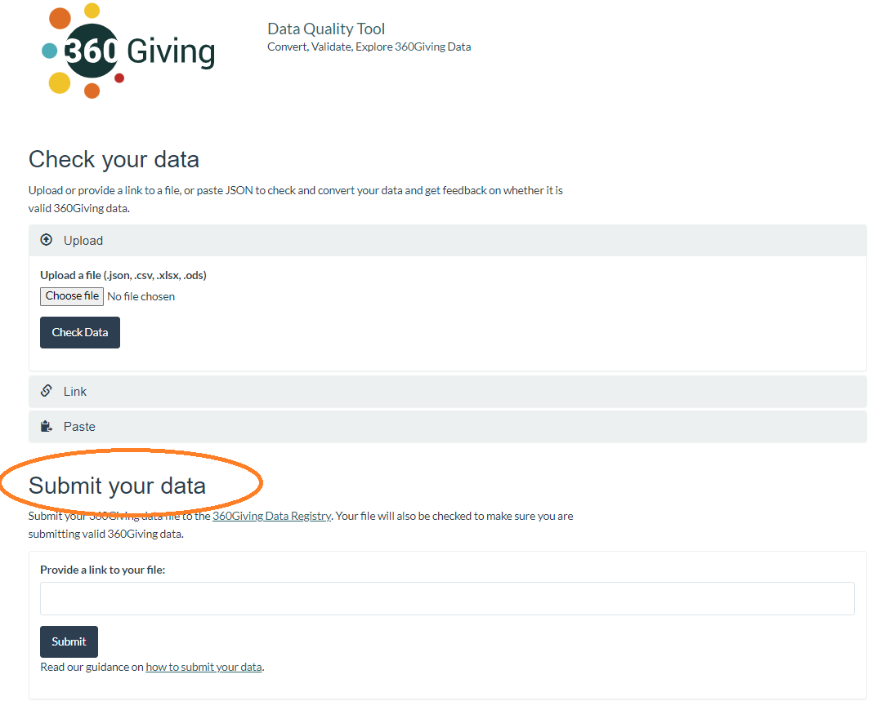

# Submit your data to the Registry
Once 360Giving data has been published by an organisation, the file must be added to the <a href="https://data.threesixtygiving.org/" target="_blank">360Giving Data Registry</a> so that the data appears in 360Giving’s tools, including <a href="https://grantnav.threesixtygiving.org" target="_blank">GrantNav</a> and <a href="https://insights.threesixtygiving.org" target="_blank">360Insights</a>.

Publishers of 360Giving data can add their valid 360Giving data files to the Data Registry using the 360Giving data file submission form. 

The form allows users to:
- Update an existing Data Registry entry with an updated version of an existing file
- Add an entry for a new file to the Data Registry

Only publishers with an authorised website domain can use the data file submission process.

## Authorised domains
By default, the website domain used by existing publishers to host their 360Giving data files will be authorised.

Organisations that publish 360Giving data for the first time can also use the 360Giving data file submission process once they have registered their website domain with 360Giving. To register your website domain prior to publishing for the first time, please contact the 360Giving Helpdesk at <support@threesixtygiving.org>.

Publishers can opt out of authorising their website domain and using the 360Giving data file submission process on request.

### Which domains are not authorised?
Data files published on multi-user hosting platforms, like open data repositories or file-sharing services such as Google Sheets, SharePoint or Dropbox, cannot be submitted with the 360Giving data file submission process because the domain cannot be authorised as being unique to a particular organisation. 

Files published in this way can only be added to the 360Giving Data Registry by emailing the 360Giving Helpdesk at <support@threesixtygiving.org>.

## How to use the 360Giving data file submission process
To add a file to the 360Giving Data Registry, it must:
- Contain valid 360Giving data, which means it has passed the <a href="https://dataquality.threesixtygiving.org/" target="_blank">Data Quality Tool</a> checks
- Be published online via a publicly accessible link
- And be accompanied by an open license which gives permission for its use

For further information, read our guidance on using the [Data Quality Tool](../../guidance/data-quality/) to check data quality, and [publishing your data openly](../../guidance/publish-data-openly/).

You should also make sure the data is ready to be published in terms of its contents. 

Please only submit a file to the 360Giving Data Registry if you are sure that it includes the correct information, and there is nothing in the data that is unsuitable for publishing as open data. Find out more about what to check before publishing your data openly in our [data protection guidance](../../guidance/data-protection/).

You are only able to submit one file at a time. To submit multiple files, you will need to use the 360Giving data file submission process to submit each file separately.

### Submit the link to your file
Once your 360Giving data is ready to be added to the 360Giving Data Registry:
- Go to the <a href="https://dataquality.threesixtygiving.org/" target="_blank">Data Quality Tool</a> and refresh the page
- Find the **Submit your data** section, under the **Check your data** section
  
- Paste the link to your file into the **Provide a link to your file** dialogue box. An example of a link to a file is **https://www.examplefoundation.com/360Givingdata/EXAMPLE_FILE_NAME.xlsx**
- Click **Submit**

If the file at that link contains valid 360Giving data and is hosted on an authorised domain, you will see a green tick on the **Submit your data** section, and be able to click on the **Submit your file** button. This will open the data file submission form.

If the data is not valid, the Data Quality Tool will provide feedback about the issues that need to be resolved before proceeding. 

**Tip:** If your file is linked from a webpage, you can find the file link by right-clicking on the link and selecting **Copy link address** from the menu that appears. If your file is saved in your website content management system, you can find the file URL in the details or properties of the file. Please contact the 360Giving Helpdesk at <support@threesixtygiving.org> if you need any help finding the link to your file.

### Provide contact details
Provide your **name** and **email address**. 

You and the primary publisher contact for the organisation (if these are different) will receive an email acknowledgement to confirm the update to the 360Giving Data Registry.

### Pick the file submission option
If this is the first time your organisation has submitted 360Giving data to the 360Giving Data Registry, you will be taken straight to the form for adding a new file.

If your organisation has published 360Giving data before, you will be presented with two options.
- Update an existing Data Registry entry
- Submit a new Data Registry entry

If none of the grant data in the file has been published before, select the option to **Submit a new Data Registry entry**.

If your file includes grants that have already been published and appear in 360Giving’s tools (such as GrantNav), you need to replace your existing file with an updated version, by selecting the option to **Update an existing Data Registry entry**. The updated version of the file should contain all the grants that have already been published and the new grant data.

To find out which file you need to update, check your organisation’s entry on the <a href="https://data.threesixtygiving.org/" target="_blank">360Giving Data Registry</a>.

If you are not sure if any of the grants in your file already appear in 360Giving tools, check <a href="https://grantnav.threesixtygiving.org/funders" target="_blank">your organisation’s GrantNav page</a>.

#### Submit a new Data Registry entry
If you select **Submit a new Data Registry**, the form asks you to provide the following basic information about your 360Giving data file:
- **Title and Description**. These are text fields that can be used to provide information about the name of the file and its contents and provide further contextual information if appropriate 
- The **Title** is required, has a character limit of 80 characters and will be displayed on the Data Registry
- The **Description** is optional, has a character limit of 255 characters and is not publicly displayed on the Data Registry
- **Access URL**. This is the URL of the webpage where the link to your data file can be found or your main website address
- **License**. This is the open license that applies to the data. The details of the license should normally be found alongside the link to your file on your website. The overwhelming majority of publishers use **Creative Commons Attribution License 4.0**, unless they are a public sector organisation, which should use **Open Government License 3.0** instead. For further information read our [guidance on open licences](../../guidance/publish-data-openly/)

#### Update an existing Data Registry entry
If you select **Update an existing Data Registry entry**, you will be presented with a table with the five most recent Data Registry entries for the files published by your organisation. You may need to adjust the column width and scroll across to view the full file titles and URLs.

If you have **more than five** Data Registry file entries and the file you want to update is not shown, contact the 360Giving Helpdesk at <support@threesixtygiving.org> to update the file entry on your behalf.

Select the file entry you want to amend and edit the following fields if needed:
- **Title and Description**. These are text fields that can be used to provide information about the name of the file and its contents and provide further contextual information if appropriate 
- The **Title** is required, has a character limit of 80 characters and will be displayed on the Data Registry
- The **Description** is optional, has a character limit of 255 characters and is not publicly displayed on the Data Registry
- **Access URL**. This is the URL of the webpage where the link to your data file can be found or your main website address
  
### Agree to Terms and Conditions
Once you have filled out the required information about your file, you will be presented with a preview of the information you have entered.

You will be asked to agree to the following on behalf of your organisation:
- You are authorised to submit this file to the 360Giving Data Registry on behalf of your organisation
- There is no personal data in the file, or consent to share personal data has been obtained, in line with the [Publisher Guidance on Data Protection](../../guidance/data-protection/)
- The data is openly licensed in line with the [Publisher Guidance on Publishing Data Openly](../../guidance/publish-data-openly/). This means that anyone can download and use the data
- Your data is ready, and you give permission for the grant data in the file to appear publicly in 360Giving tools, including <a href="https://grantnav.threesixtygiving.org" target="_blank">GrantNav</a> and <a href="https://insights.threesixtygiving.org" target="_blank">360Insights</a>.

Click **Agree** to go to the final page, which will confirm that the update to the Data Registry has been made.

An acknowledgement email will be sent to the contact email address provided, and the email of the person marked as the primary publisher contact for your organisation in 360Giving’s systems. If this is the same contact, the acknowledgement email will only be sent once. 

## Getting further help
If you experience issues or need further guidance on using the 360Giving data file submission process, please contact the 360Giving Helpdesk at <support@threesixtygiving.org> or call 020 8145 8043, and press 1 for publisher support.

### What's next?
Read our guidance about making updates to your 360Giving data.
