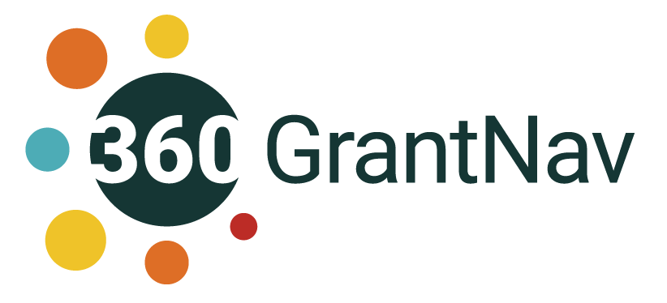
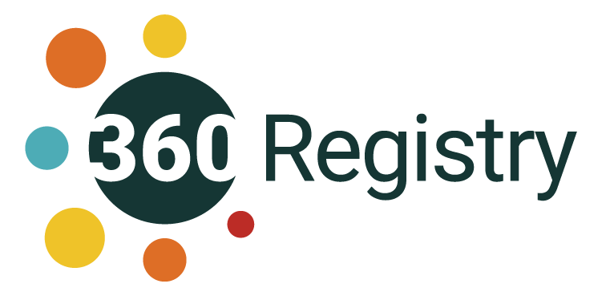

# Using 360Giving data
At 360Giving, we help funders publish open data about who, what and where they fund, using the 360Giving Data Standard.

This means they are sharing information about their funding in a way that others can access and use, for free. Because the data is standardised, it can be looked at and analysed all together, helping us all to understand grantmaking across the UK.

360Giving has developed tools to make the data easier for people to explore.

### Want to see funding trends across the UK?
<a href="https://grantnav.threesixtygiving.org" target="_blank">GrantNav</a> is search engine for grants data. Explore and download data about where funding goes and how much is given across billions of pounds of grants, for causes and locations across the UK.

### Want to understand a particular funder better?
<a href="https://insights.threesixtygiving.org" target="_blank">360Insights</a> is a tool to help you understand funders better. You can combine and visualise 360Giving and charity data, and explore funders across different areas – from their grant dates to types of recipients.

### Want a list of all the funders who make their grants data open?
<a href="https://data.threesixtygiving.org/" target="_blank">The Data Registry</a> is a list of all the organisations that currently publish their grants data in the 360Giving Data Standard, with direct links to their data sources.

## Do you have more complex data needs?
<a href="https://www.threesixtygiving.org/data/using-360giving-data/" target="_blank">Our page</a> on using 360Giving data outlines the different ways that developers, researchers and others can access grants data in the 360Giving Data Standard.

<a href="https://www.threesixtygiving.org/data/360giving-datastore/" target="_blank">The Datastore</a> The Datastore offers a convenient way for developers, researchers and other users with more complex needs to access grants data published in the 360Giving Data Standard directly and run queries on it.
