# Data Preparation templates

## Introduction

360Giving Data Preparation templates are Excel files designed to make the technical steps of formatting grant information into 360Giving data more straightforward, and to support good data protection practice in the data preparation stages for funders of grants of individuals.

Each template can be tailored to each funder’s data and needs, however they are all set up in the same way with a range of sheets – including sheets for the source information from your systems or files, a sheet for information about your organisation required for creating 360Giving data, and a final sheet which formats the information you have provided into 360Giving data using formulas. 

There are two types of Data preparation template:
- **360Giving-Grants-to-Inds-Data-Preparation-Template_Codelist-Mapping**
- **360Giving-Grants-to-Inds-Data-Preparation-Template_Manual-Coding**
**Please note:** The guidance provided includes steps and screenshots based on the default templates. If your version of the template has been modified to add or remove fields the exact range and position of columns may be different.

    <h3 class="box__heading">Getting further help</h3>
    
The Data Preparation templates have been set up to work a specific way, but there is some flexibility in how they can be used. If significant changes are needed, additional support can be provided by contacting 360Giving Helpdesk via <a href="mailto:support@threesixtygiving.org">support@threesixtygiving.org.</a> 

## How the template is set up
By default the **Codelist-Mapping** template has seven sheets, as follows:
### source_data_mapping
This sheet provides a full list of the required and recommended fields included in the template, with a description of each, with space to fill in how these map to the data from your internal systems and to capture any notes and considerations.

Use this sheet to identify if you are missing any required information, to note data protection considerations and agree the range of information your organisation will publish about your grants to individuals.

If there is information that you want to share that isn’t covered by the required and recommended fields, you should make a note of these and 360Giving Helpdesk can amend your template to incorporate them.
### tailored_settings
This sheet includes information like your organisation name, organisation identifier and publisher prefix, which are needed to populate certain fields.

It also has data protection settings which control whether grant Identifiers and recipient identifiers from your systems are included in your 360Giving data, or automatically generated identifiers are used instead. See [guidance on setting up your template](#setting-up-your-template) for further details.
### codelists
This sheet includes the full details of the two codelists that have been developed for use by funders of grants to individuals; **Grant to Individuals Reason** and **Grant to Individuals Purpose**, for reference purposes.
### codelist_mapping
This sheet is set up to allow for any funder-specific categories for the reason for awarding the grant or the purpose of the grant to be mapped against the shared 360Giving codelists.

The **Manual-Coding** version of the template does not include this sheet because it is for use when the coding of the grant data has to be done manually.
### geo_data
This sheet is used to support converting postcode data into Ward area or higher geocodes, for data protection purposes. Instructions for how to convert postcode data into geocodes and use this sheet is included in the [How to use the template](#how-to-use-the-template) section.
### source_data
This sheet is for the grants information collated from your files or data exported from a grants management system.

By default this includes all the fields of data needed to populate all the 10 core required fields, shared codelist fields and recommended fields. If no data is available for any of the recommended fields, or this information is not relevant to your grantmaking, these can be left blank. If you identify additional data to include, it can be added to the template with support from 360Giving Helpdesk.

The first four columns in the **source_data** sheet are for identifying information about grant recipients. These fields are included to make it easier to prepare and check the data. 
- The recipient names and postcodes are not linked to the **360_data** sheet which includes the information to be published, and _**will not be shared outside of your organisation**_. 
- The grant and recipient identifiers will only be included in the **360_data** sheet if the **tailored_settings** data protection settings are set to ‘Publish’.
### 360_data sheet
This sheet contains the correctly formatted 360Giving data based on the source information provided. The top row in the sheet has the 360Giving Data Standard titles, and in following rows there are a range of formulas set up to combine data from the other sheets, to create the 360Giving formatted data. 

This means that any changes in the content of the data in the **source_data**, **tailored_settings**, **codelist_mapping** or **geo_data** sheet will be picked up automatically in the **360_data** sheet.

**Please note:** Do not add data directly into the **360_data** sheet or make any changes to this sheet, apart from extending the number of rows with formulas or resetting **#REF!** Errors (see further guidance on [setting up your template](#setting-up-your-template)). 

Adding data directly into this sheet will break the formulas used to format the data. This will stop the template working correctly and increases the risk of sharing data that does not pass 360Giving’s validity checks, or unintentionally includes personal data.
### Default settings
The formulas in **360_data** sheet extend for the first 100 rows. This means that up to 100 grants can be converted by the template. See the [section on extending the formulas](#adding-more-rows-of-formulas-to-the-360-data-sheet) if you need to convert data for more than 100 grants at a time.

For ease of use, this template is colour coded so that all the 10 core required items are highlighted green, the codelist fields are blue and the recommended but optional fields are yellow. For more information see our [Field guidance](../../individuals/publisher-guidance/#field-guidance).
### How the template works
The formulas and setup of the tool perform three types of actions to transform the data:
1. Some of the changes simply match the source data provided to the appropriate 360Giving Data Standard titles, but leave the content unchanged.
2. Some fields also change the format of the data – e.g. changing dates from 27/11/2022 to 2022-11-27 – which is the date format required by 360Giving Data Standard.
3. Some other changes involve combining data from one or more of the sheets e.g. – **Identifier** and **Recipient Ind:Identifier** are often created from a unique grant ID and recipient ID taken from a grants management system, with your publisher prefix which starts **360G-**. For more information see our guidance about [Identifiers](../../technical/identifiers/#grant-identifier) and [Recipient Org:Identifiers](../../technical/identifiers/#organisation-identifier).
## Setting up your template
### 1. Add in your organisation’s details
Fill in your organisation’s data in the **tailored_settings** sheet. The publisher prefix and guidance on what Funding Org:Identifier to use will be provided by 360Giving Helpdesk when you fill out the [Publisher Registration form](../../individuals/publisher-guidance/#register-with-360giving-helpdesk).

    <table>
        <thead>
            <th>360Giving Title</th>
            <th>Example data</th>
            <th>Notes</th>
        </thead>
        <tbody>
            <tr>
                <td class="table__lead-cell" data-header="360Giving Title">Identifier</td>
                <td data-header="Example data">360G-ExampleFunder-</td>
                <td data-header="Notes">Fill in your Publisher prefix provided by 360Giving Helpdesk followed by a dash.</td>
                </td>
            </tr>
            <tr>
                <td class="table__lead-cell" data-header="360Giving Title">Currency</td>
                <td data-header="Example data">GBP</td>
                <td data-header="Notes">This is the currency code for British Pounds. You do not need to change this setting unless you award grants in other currencies. Contact 360Giving Helpdesk to update the template to work with other currencies.</td>
                </td>
            </tr>
            <tr>
                <td class="table__lead-cell" data-header="360Giving Title">Recipient Ind:Identifier</td>
                <td data-header="Example data">360G-ExampleFunder-IND-</td>
                <td data-header="Notes">Fill in your Publisher prefix provided by 360Giving Helpdesk followed by -IND-</td>
                </td>
            </tr>
            <tr>
                <td class="table__lead-cell" data-header="360Giving Title">Recipient Ind:Name</td>
                <td data-header="Example data">Individual Recipient</td>
                <td data-header="Notes">To anonymise the grants, the default name for individuals is ‘Individual Recipient’. You do not need to change this setting.</td>
                </td>
            </tr>
            <tr>
                <td class="table__lead-cell" data-header="360Giving Title">Funding Org:Identifier</td>
                <td data-header="Example data">GB-CHC-123456</td>
                <td data-header="Notes">Fill in your Funding organisation identifier provided by 360Giving Helpdesk.</td>
                </td>
            </tr>
            <tr>
                <td class="table__lead-cell" data-header="360Giving Title">Funding Org:Name</td>
                <td data-header="Example data">Example Funder</td>
                <td data-header="Notes">Fill in your organisation’s name, as you want it to appear in your data.</td>
                </td>
            </tr>
            <tr>
                <td class="table__lead-cell" data-header="360Giving Title">Last Modified</td>
                <td data-header="Example data">dd/mm/yyyy</td>
                <td data-header="Notes">This defaults to today’s date, and captures the last time the data in the file was modified. You do not need to change this setting.</td>
                </td>
            </tr>
            <tr>
                <td class="table__lead-cell" data-header="360Giving Title">Data Source</td>
                <td data-header="Example data">https://www.example.com</td>
                <td data-header="Notes">Fill in the link to your website, fully formatted with http:// or https:// at the start.</td>
                </td>
            </tr>
        </tbody>
    </table>

#### Codelist_Mapping template only
The following fields support the inclusion of the internal categories used to map against the 360Giving shared codelists. This allows for more granular categorisation of the grants to be included in 360Giving data.

If all grants will have fewer or more categories than default (two reasons and three purposes) further tailoring of the template can be provided by 360Giving Helpdesk.

    <table>
        <thead>
            <th>360Giving Title</th>
            <th>Example data</th>
            <th>Notes</th>
        </thead>
        <tbody>
            <tr>
                <td class="table__lead-cell" data-header="360Giving Title">Classifications 0</td>
                <td data-header="Example data">Primary grant reason</td>
                <td data-header="Notes">Fill in the name for your internal category list which is mapped against Primary Grant Reason. This could be the field name from your system or suitable alternative name.</td>
                </td>
            </tr>
            <tr>
                <td class="table__lead-cell" data-header="360Giving Title">Classifications 1</td>
                <td data-header="Example data">Secondary grant reason</td>
                <td data-header="Notes">Fill in the name for your internal category list which is mapped against Secondary Grant Reason. This could be the field name from your system or suitable alternative name. Leave blank only the primary reason is being shared.</td>
                </td>
            </tr>
            <tr>
                <td class="table__lead-cell" data-header="360Giving Title">Classifications 2</td>
                <td data-header="Example data">Grant purpose</td>
                <td data-header="Notes">Fill in the name for your internal category list which is mapped against Grant Purpose. This could be the field name from your system or suitable alternative name.</td>
                </td>
            </tr>
            <tr>
                <td class="table__lead-cell" data-header="360Giving Title">Classifications 3</td>
                <td data-header="Example data">Grant purpose</td>
                <td data-header="Notes">Fill in the name for your internal category list which is mapped against Grant Purpose. This could be the field name from your system or suitable alternative name. Leave blank if not being used.</td>
                </td>
            </tr>
            <tr>
                <td class="table__lead-cell" data-header="360Giving Title">Classifications 4</td>
                <td data-header="Example data">Grant purpose</td>
                <td data-header="Notes">Fill in the name for your internal category list which is mapped against Grant Purpose. This could be the field name from your system or suitable alternative name. Leave blank if not being used.</td>
                 </td>
            </tr>
        </tbody>
    </table>

### 2. Update your Data Protection settings
The **tailored_settings** sheet also includes two **Data Protection settings**, which control whether the unique identifiers from your grants management system are shared in 360Giving data.
- Data Protection settings - Grant Identifier
- Data Protection settings - Individual Identifier

There is a dropdown with two options:
- ‘Publish’ OR ‘Do not publish’

Use the Data Protection checklist to help decide whether the grant and recipient identifiers from your internal systems are suitable for publishing in your 360Giving data. By default these are set to ‘Do not publish’.

### 3. Map your internal categories to the shared 360Giving codelists
#### Codelist_Mapping template only
In the **codelist_mapping** sheet, paste the list of any internal categories you may use to tag your grants into the relevant internal funder category column. If you do not have any relevant internal categories that can be mapped, you should use the **Manual-Coding** template and refer to the [Manual coding template guidance](#manual-coding-template).

You can map your categories to 360Giving’s Grant Reasons codes from columns A to B and to 360Giving’s Grant Purposes codes from columns F to G.

By default there is space for 50 internal categories to be mapped. Paste them into:
- **column A** for categories that are most closely aligned to the Grant Reason definition
- **column F** for categories that are most closely aligned to the Grant Purpose definition
 
Then, for each of your internal categories, pick the appropriate Reason or Purpose title from the drop-down list in:
- **column B** for Reason codelist
- **column G** for Purpose codelist

**Please note:** Do not edit or amend the data in columns C or H as these contain formulas for mapping the titles to the correct codes.

As the shared 360Giving codelists categories are broad, you may have multiple internal categories mapped against the same code. They are also intended for a wide range of funders, so not all codes will be applicable to your grantmaking. See the guidance on the codelists for further information about the options and how to code your grants. 

Once you have fully mapped your internal categories to the shared 360Giving codelists, the template will be able to automatically convert your internal categories into the correct codes for publishing in your 360Giving data, when the relevant category data is included in your **source_data** in:
- **columns I and J** for Reason categories
- **columns K, L and M** for Purpose categories

The original internal categories are also included unchanged in the **source_data** under Classifications fields in **columns Z to AI**.

If you only have one reason category or fewer than three purpose categories, the extra columns can be left blank.

360Giving’s recommendation is that **no more than three** purpose categories are included in the **To Individuals Details:Grant Purpose** field. If you have more than three purpose categories to share for each grant, this information can be incorporated into the Description field instead. 

If the categories for your grants are exported as a comma separated list rather than separate columns, the template will need to be updated. 

Please contact 360Giving Helpdesk via <support@threesixtygiving.org> to request an update to your template to work with extra purpose categories or comma separated lists of categories.
### 4. Remove the example grants data
The template has been set up with five example grants entered in the **source_data** sheet to show how the template works.

Once you are ready to start using the template with your own data, please delete the following information by selecting and **clearing** the contents:
- Five rows of grants information the **source_data** sheet (rows 4 to 8)
- All the data in the **geo_data** sheet
- Data in cells A3 to B5 and F3 to G8 in the **codelist_mapping** sheet.

Please do not delete the rows as it will cause errors with the formulas in **360_data** sheet.
### 5. Adding more rows of formulas to the 360_data sheet
By default, the formulas in the **360_data** sheet extend for 100 rows, so they will convert the first 100 rows of grant data entered into the **source_data** sheet.
If you have more than 100 grants to convert at a time you need to increase the number of rows with formulas in the **360_data** sheet to match the number of rows in the **source_data** sheet.

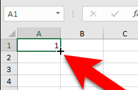

To extend the formulas:

1\. Select all the cells in the last row with formulas in the **360_data** sheet (e.g. from **cell A101 to AI101**) and drag the formulas down.

2\. The drag control is the small green square in the bottom right corner of the bottom right-most cell (e.g. AI101).

3\. Hover over the square until it turns into a **black plus-sign +** then select and drag down to add as many rows as you need.
### 6. Fixing errors that appear in the 360_data sheet formulas
If you delete a row from the **source_data** sheet to remove a grant record, this will result in a **#REF!** error in the **360_data** sheet. This error will need to be fixed by resetting the formulas.

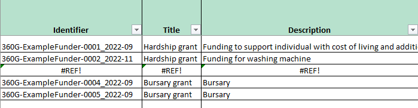

The formulas can be reset by taking the following steps:

1\. In **360_data** sheet select all the cells in row 2 that have data – from **column A to AI**. This is the row under the colour highlighted titles.

2\. When the entire row of data is selected you will see a small green square at the bottom right corner of the cell **AI2** – see screenshot.

3\. When your cursor is over the green square it will turn into a cross **+**

4\. Double click on the cross **+** with your cursor.

5\. The formulas will update in all the rows below, and remove any **#REF!** errors.

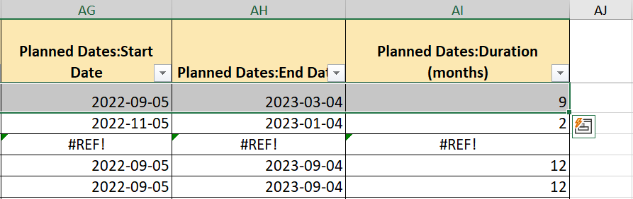
## How to use the template
The templates can be used either to start collecting grants data in order to publish it or to convert your existing grants data - stored in a grants management system or spreadsheets - into the 360Giving format.

You may wish to start collecting data using the template if you do not have a grantmaking database and do not have historic grants data to share, or the data you have is not suitable for converting into the 360Giving format.

If you do have a grantmaking database or spreadsheet(s) for collecting grants data in place already, you should be able to set up the conversion logic once, and then import future rounds of data without needing to amend the template again.
### Collect data
Enter the data you want to publish onto the **source_data** sheet under the appropriate headings.

Full descriptions of all of the fields and guidance on how to populate each field is available in the **source_data_mapping** sheet and the [Field guidance](../../individuals/publisher-guidance/#field-guidance).
### Convert data
This method will work with data that is ready in a spreadsheet – this could be either a spreadsheet you use to manage your information, or a report you have exported from a grants management system.

1\. Copy the data from your spreadsheet of grant data into **source_data** sheet. Make sure the headings in your exported file match the order of columns in the **source_data** sheet and paste the data so it aligns with **column A**.

2\. Full descriptions of all of the fields is available in the **source_data_mapping** sheet, with space to fill in which fields from your internal system map to each **source_data** field.

Once your grant data is entered into the **source_data** sheet.

3\. Check the **360_data** sheet to see if the information looks correct, making changes to the data in **source_data**, not in **360_data** directly, as required.

For example:
- Are there as many rows of grants as expected? If there are fewer rows of grants in the **360_data** sheet than in the **source_data** sheet you will need to extend the formulas to cover more rows, see [further guidance above](#adding-more-rows-of-formulas-to-the-360-data-sheet).
- Are any of the cells blank or feature **#N/A** errors? All columns with a green title must include information in each cell because these are required fields which cannot be blank. Other columns without green headers may have blank cells if there is no information available. If any cells include zeros or #N/A errors, check the information in **source_data** sheet to see if there is a problem with the data and correct as needed.
- Does the content of the data in **360_data** look right? If the values in the columns look wrong, there may be a mismatch between the mapping of the **source_data** fields with the 360Giving headings. Check the **source_data** to see if the order of the columns needs to be changed or if the first column of your source data is not aligned with **column A** in the sheet.
### Converting Postcodes into Geocodes
<a href="https://findthatpostcode.uk/" target="_blank">Find that Postcode</a> is a tool supported and used by 360Giving to power the location functions of its tools <a href="https://grantnav.threesixtygiving.org" target="_blank">GrantNav</a> and <a href="https://insights.threesixtygiving.org" target="_blank">360Insights</a>.

The tool has a free and easy-to-use service called ‘<a href="https://findthatpostcode.uk/addtocsv/" target="_blank">Add fields to CSV</a>’ which allows you to upload a list of UK postcodes into the tool and then download a file with corresponding ONS and other official area geocodes.

The template has been set up to work with data enriched with <a href="https://en.wikipedia.org/wiki/ONS_coding_system" target="_blank">ONS geocodes</a> using this service. Follow these steps to convert the postcodes in your data into Ward geocodes.

1\. Copy all the postcodes in your source data from **column D** of **source_data** sheet into **column A** of a new file. Do not include the first two rows (highlighted orange in **source_data**) but do include the third row containing the title **Recipient Postal Code**.

2\. Save the file as CSV UTF-8 (Comma delimited) and give it a suitable name – e.g. Postcode_lookup.

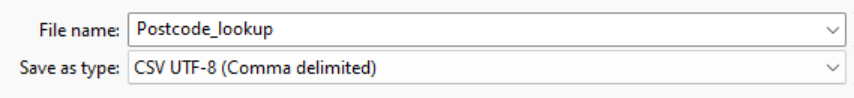

3\. Upload this file into the <a href="https://findthatpostcode.uk/addtocsv/" target="_blank">‘Add fields to CSV‘ service</a>.

4\. Select the field that includes your postcode data, named **Recipient Postal Code**.

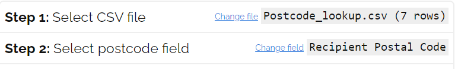

5\. In the Key areas section also tick both Ward Code and Ward Name. Latitude/Longitude, Region and Local Authority are selected by default and should be included.

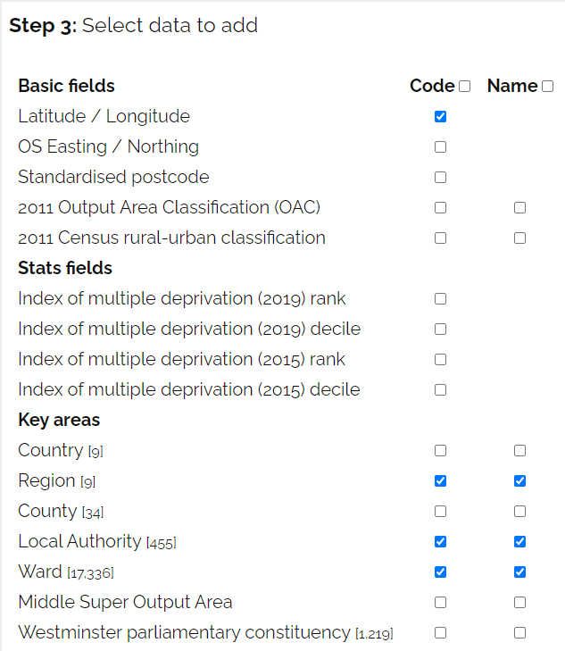

6\. Click the yellow ‘Add data to CSV‘ button at the bottom of the page. The tool will automatically download an updated version of your file with the geocodes and place names in eight extra columns.

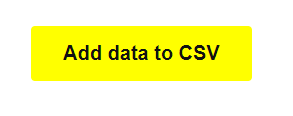

7\. Paste the data from the downloaded CSV file into the **geo_data** sheet in your template, ensuring that **column A** includes your postcodes.

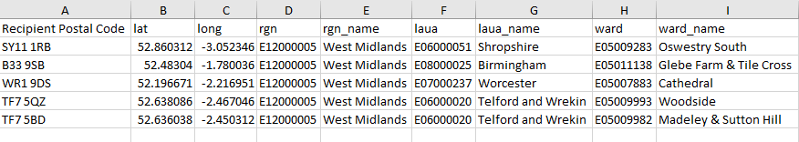

8\. A lookup formula in the **360_data** sheet will then look up the Ward and Local Authority name and geocodes from the **geo_data** sheet, populating the data in **columns N to S**.

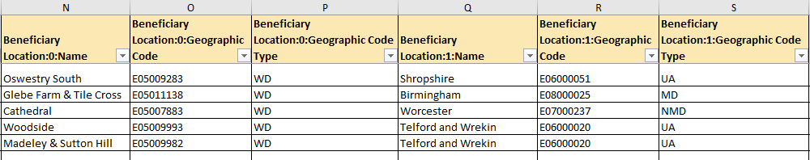

#### Using Find that Postcode and Data protection
When using the ‘Add fields to CSV’ service, your file of postcode data does not leave your computer. For data protection, a code is created based on each postcode in your file, and it is this code that is sent to Find that Postcode. This provides a level of privacy protection, and because the initial file you provided only includes postcodes and no other identifying information, the risks of using the service with personal address data has been minimised.

Find that Postcode’s <a href="https://findthatpostcode.uk/addtocsv/" target="_blank">full statement about privacy can be found on this page</a>. 
## Manual coding template
For funders without existing internal categories that can be mapped to the shared 360Giving codelists, there is an alternative template to use: **360Giving-Grants-to-Inds-Data-Preparation-Template_Manual-Coding**

This works in the same way as the main template but without the **codelist_mapping** sheet. Instead the **source_data** sheet has a drop-down list with the shared 360Giving codelist titles which can be selected to manually code the grants data.
- **columns I and J** for Reason titles
- **column K, L and M** for Purpose titles. 
If your grants always fit within one or two main categories, the values can be copy/pasted or copied by dragging down the values in the column.

If you only have one reason category or fewer than three purpose categories the extra columns can be left blank.
## Next steps
### Testing your 360Giving data
1. Once your data has been prepared, the information in **360_data** sheet only needs to be copied into a new file, copying the information and formatting but not the formulas. This ensures no personal data about your grantees is shared in public 360Giving data.

    a. To do this, first select and copy all the necessary columns and rows in the **360_data** sheet. E.g. from cell A1 to cell AI101
    
    b. Then paste the copied data into the file you intend to publish, using the ‘Paste Special’ option ‘Value & Number Formatting’ (accessible via right click **%123** icon, or Home Menu > Clipboard, see screenshots below)

    c. Save the file. This removes the formulas and leaves just the 360Giving formatted data.

2. Your saved file can now be uploaded into the <a href="https://dataquality.threesixtygiving.org" target="_blank">360Giving Data Quality Tool</a> for checking.
See our guidance on how to use the <a href="https://standard.threesixtygiving.org/en/latest/guidance/data-quality/" target="_blank">Data Quality Tool</a> for further information.

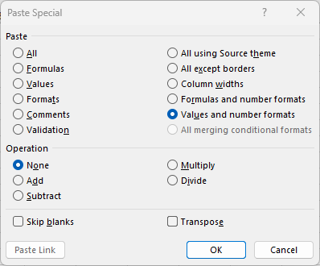

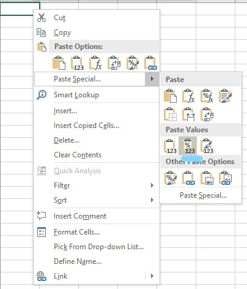
### Publishing your 360Giving data
Once your data passes the Data Quality Tool’s checks – and you are happy with the content of the data and you have ensured there is no personal data appearing in the 360Giving formatted data – the file is ready to be published online.

For further information see our guidance on [publishing data openly](../guidance/publish-data-openly/).

Once your 360Giving data file is published, the final step is to let us know so the link to the file can be added to the <a href="https://data.threesixtygiving.org/" target="_blank">360Giving Data Registry</a>.

For further information see our guidance on [submitting your file to the Registry](../../guidance/publish-data-openly/#register-your-file-with-360giving).

Once you have already published 360Giving for the first time, you can use the template and follow the same steps to format your next batch of grants, but this time opting to either copy the new grants into the existing file with your 360Giving data or setting up a new file.

For further information see our guidance on [making updates to your 360Giving data](../guidance/making-updates/).

### What's next?
Click next to view the Technical information about the Standard.
